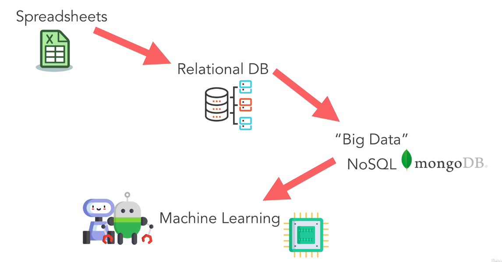
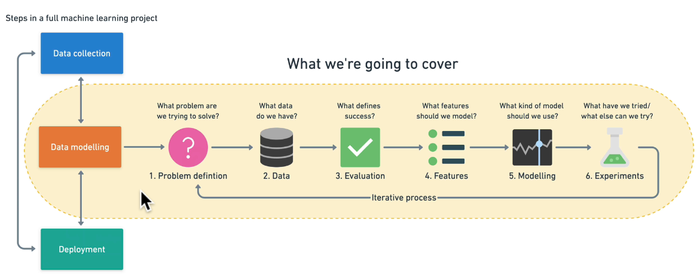
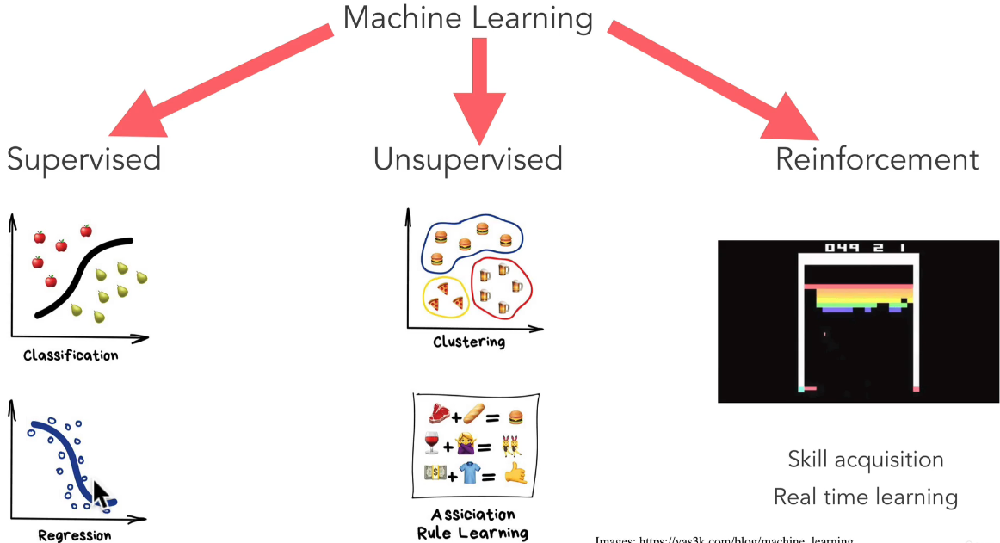
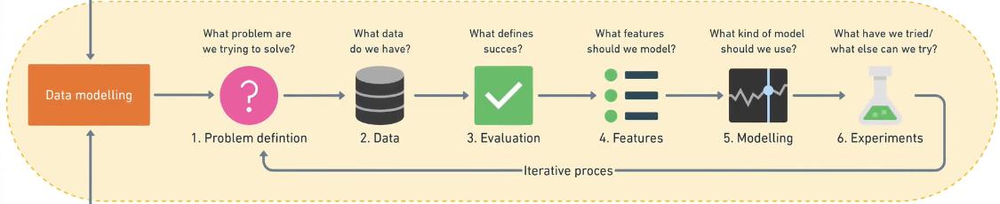

# Basics 

## What is Machine Learning?

Machine learning is the science of getting computers to act without being told how to do it.
Machine learning is a subset of artificial intelligence (AI).

AI - Machine Learning - Deep Learning - Data Science Overlaps with all of this.

---

## History of Machine Learning. How it all started?

In the starting, big businesses used to store their data in spreadsheets, and they used to do all the calculations and decision-making based on those sheets, but as the data grew in size, we created a different method of Relational Database where we used Languages like SQL to store data in tables and differentiate between the data. 
But then came the concept of 'Big Data' where data was large, complex and unstructured. We started using NoSQL databases like MongoDB to store this data.
And to make calculations based on these 'Big Data' was almost impossible for humans. So we started using Machine Learning to make calculations and decision-making based on these 'Big Data' without human intervention.

---

## Steps in Full Machine Learning Process

### 1. Data Collection

Data is collected from different sources like sensors, cameras, etc.

### 2. Data Modelling

Model is created through various steps - Problem Definition, Available Data, Evaluation, Features, Modelling, and Experiments. 

### 3. Deployment

Model is deployed to make predictions on new data. 

---

## Types of Machine Learning

### Supervised Learning 

Supervised learning is a type of machine learning where the model is trained on labeled data. The goal of supervised learning is to predict the correct output for new input data.

E.g. - Predict the price of a house based on its features like size, location, etc.

### Unsupervised Learning

Unsupervised learning is a type of machine learning where the model is trained on unlabeled data. The goal of unsupervised learning is to discover patterns and relationships in the data.

E.g. - Cluster different kind of items bought together at amazon.

### Reinforcement Learning

Reinforcement learning is a type of machine learning where the model is trained to learn from experience(by doing something and getting a reward for success). The goal of reinforcement learning is to maximize rewards over time.

E.g. - Train a robot to play a game.

---

## Machine Learning Frameworks

These are the set of steps that we can follow to create almost any Machine Learning Model.

### 1. Problem Definition 

The very first step is to figre out what kind of problem we are dealing with. Is it supervised or unsupervised? Is it regression or classification? 

### 2. Data 

Second step is to find out what kind of data we have. Based on the problem, there are different kinds of data - structured like exel and csv files, unstructured like images, audio and videos, etc.

### 3. Evaluation

This step is to decide - "What defines success for us?" Since Machine Learning Models can be improved again and again, we need to define a threshold for success. 

### 4. Features

What do we already know about the data? For e.g. If wew are dealing with data of patient with heart disease, then body weight, age, blood pressure, etc. are features that we already know.

### 5. Modelling

Once we have our problem and data, it's time to start building our ML model. Based on the type of problem we have, we can choose from different types of inbuilt models. 

### 6. Experimentation

This step is about asking "How can we improve our model?" or if it's not working as desired as "What can we try next?" 

