# What is the relation between AI, Machine Learning, Deep Learning and Data Science?

AI stands for Artificial Intelligence,  an intelligence which is not born but made artificially. They fall under two categories - Narrow AI, General AI.  

Narrow AI is intelligence that is excellent in doing one kind of work, even better than humans but that's all they can do. Their expertise is limited to only one field.  

General AI is supposed to be more like humans, capable of making all sorts of decisions but we are still very far behind in this field.  

Machine Learning is a subset of AI where where we teach machines to make their own decisions based on data without us telling them what to do in every step of the way.  

Deep Learning is a subset of Machine Learning. It is one of the technique or way of implementing machine learning.  

Data Science works parallel with AI and Machine learning. They all need data to learn and be able to make their own decisions. 

---

*A website to do AI related activities - https://teachablemachine.withgoogle.com/*  

# Types of Machine Learning :-

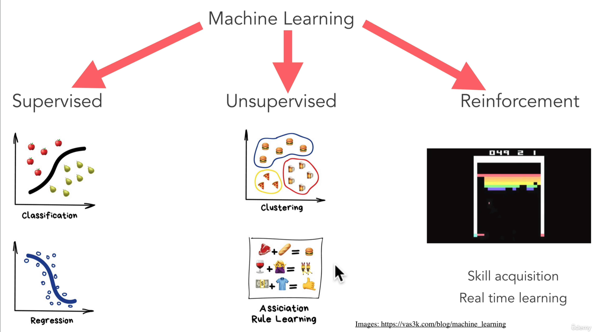  

---

# Steps to create a machine learning model

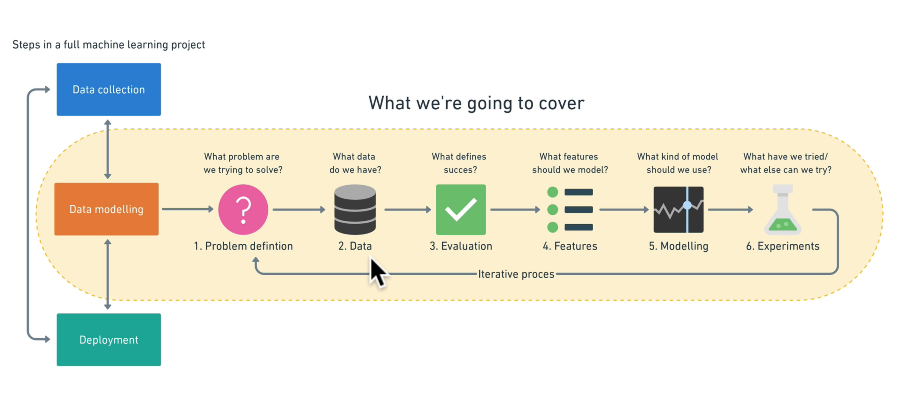

## 1. Problem Definition:-

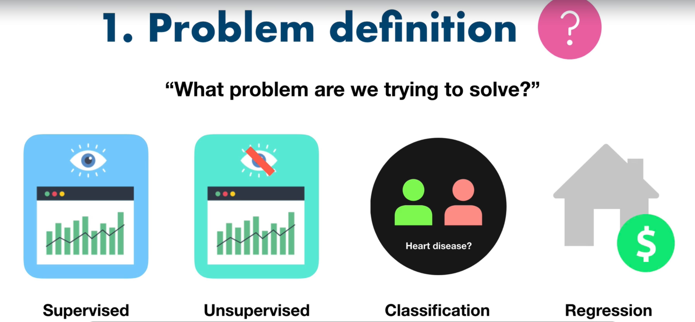  

Very first step is to define the problem.  

But all problems are not made for machine learning, You shouldn't use machine learning in the places where simple step by step instructions will work.  

Once you have a machine learning problem, categorize it as one the 4 types of machine learning:- 

### Supervised Learning: 

This is where you have data and label(results). Computer tries to predict the instructions based on data and label. If it's wrong then machine will try again and again until it's right.  

Eg. 

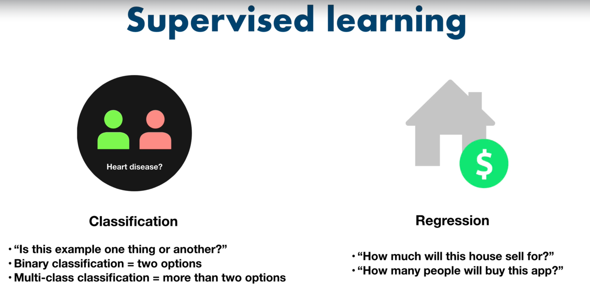  

Use when - You have data of inputs and outputs. 

### Unsupervised Learning:

Where we have clusters of data based of different facts. Patters are present but labels are generated by machine.

Eg.  

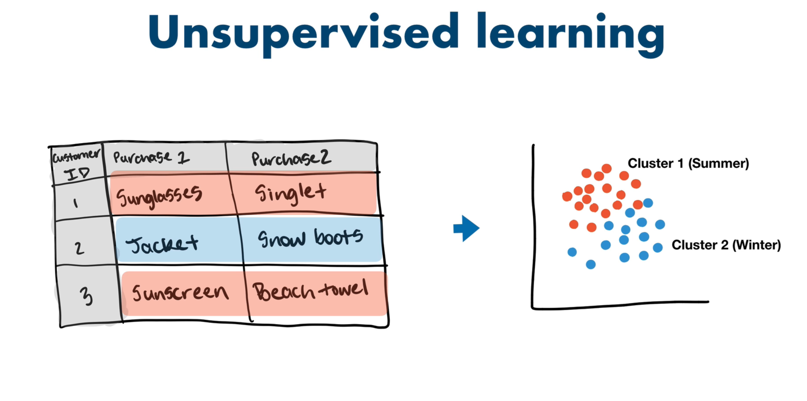

Use when - Inputs and patterns are present but no output.

### Transfer Learning:

Using one machine learning model to refine and train another.  

Eg. 

Using pre-build Image detection model and refine it to detect breed of dogs.

Use when - When you can leverage existing model.

### Reinforcement Learning:

Computer program perform some actions in a defined space and then rewarding for success or punishing for failure and repeat the process again and again.  

Eg. Creating a model to play chess.

These are very advanced models and used very rarely.

## 2. Data:-

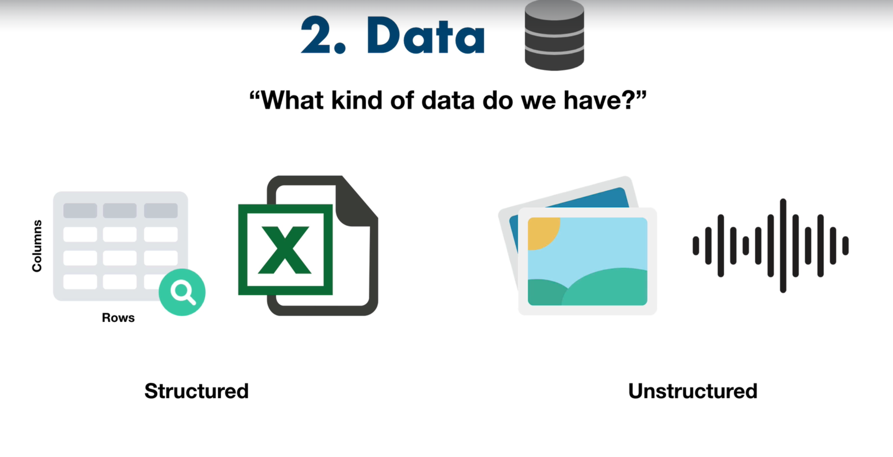  

Second step is to find out what kind of data we have.  

Data comes in different types- 

### Structured:

With rows and columns like sql data. 

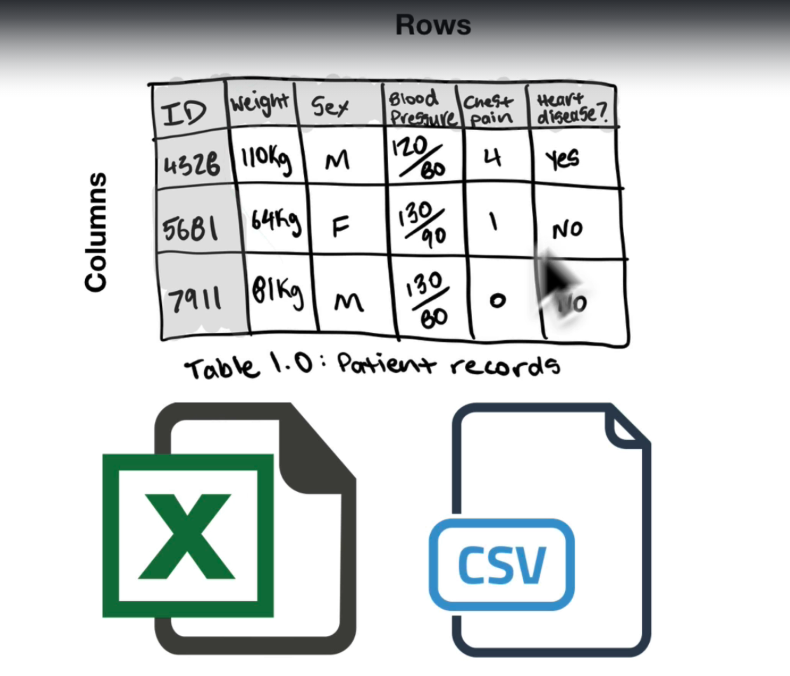  

### Unstructured data: 

Like audio, images videos etc.

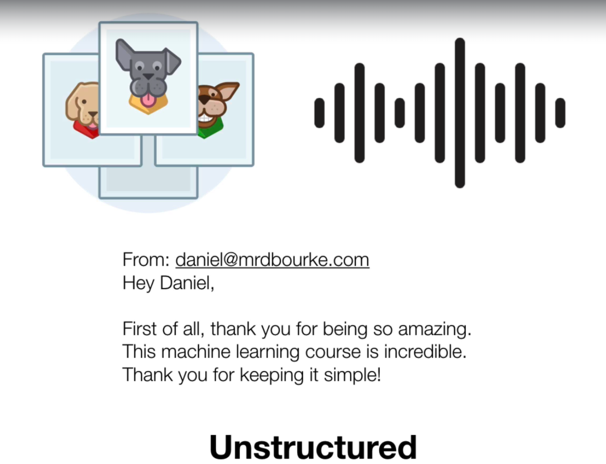  

### Static Data: 

The data that is static and not changes over time. eg. Patient records.  

These can be structured or unstructured. 

### Streaming data: 

Data that changes over time. eg. Stock Prices.  

These can be structured or unstructured.  

**Basic workflow of data science: -**  

- Open a csv file in Jupyter Notebook.
- Data Analysis using Pandas.
- Comparing different data using matplotlib.
- Building machine learning model on scikit learn.

## 3. Evaluation:-

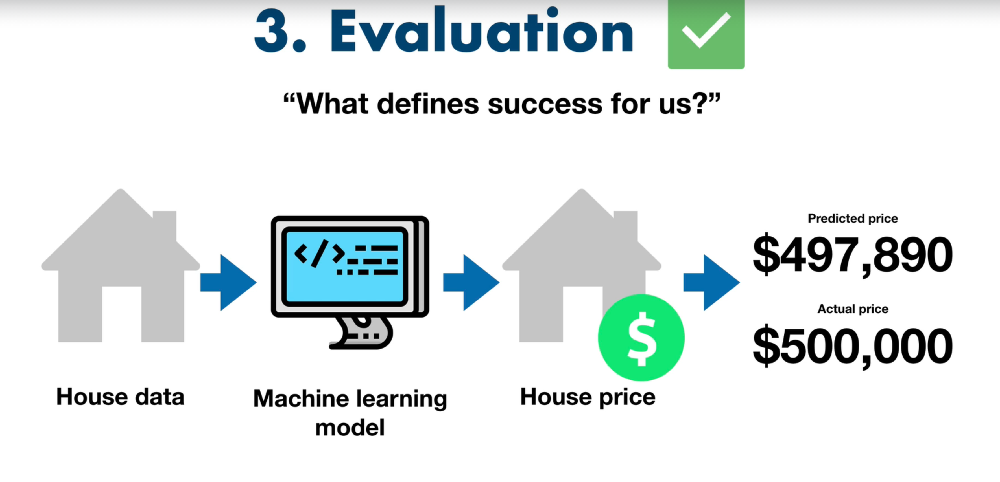  

A perfect model doesn't exist. 

 So, you have to define a success standards for yourself. What percentage of accuracy is good enough for you. 

## 4. Features:-

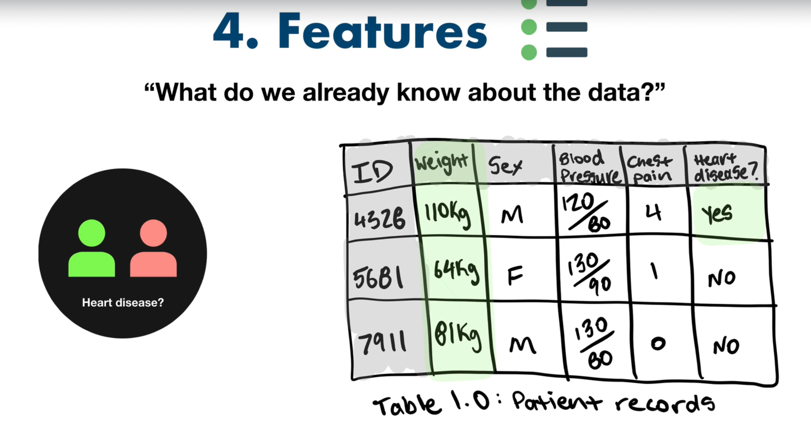  

Defines what we already know about the data.  

We already know type of data but this is types inside type.  

Like all the columns data that we are using to train our model. They can also be called feature variables, where we use them to predict target variable. 

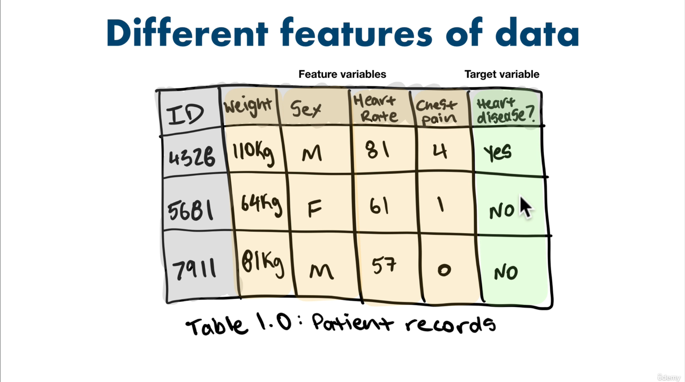

## 5. Modelling:-

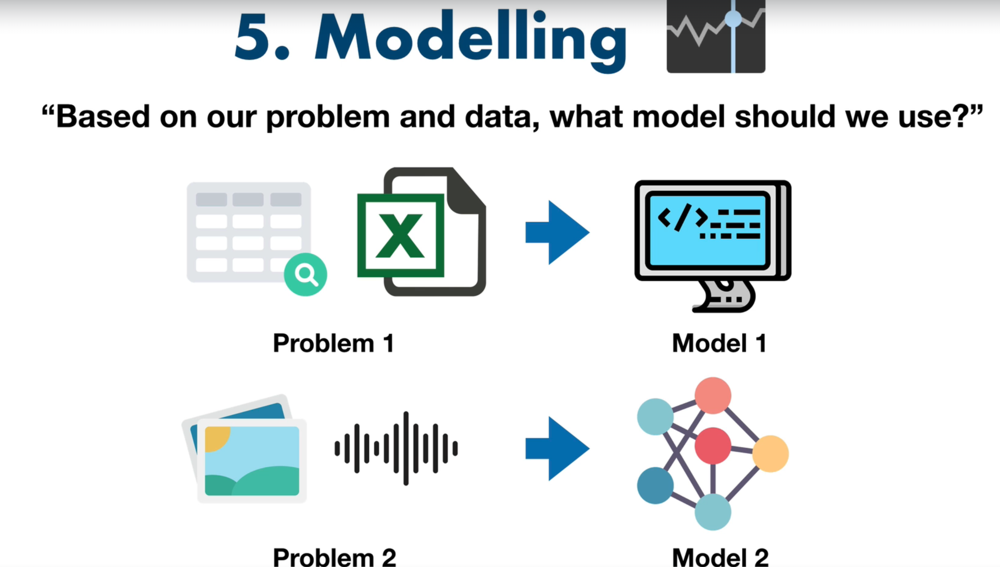  

Modelling is defined into multiple steps - 

**3 sets of modelling:-**  

When crating a model, you basically divide entire data into three sets - 

- 70% to 80% for training.
- 10% -15% for tuning.
- 10% -15% for testing.

### 1. Choosing and training a model

There are some pre-built models that you can choose based on the type of dat you are working with - 

- Structured Data - CatBoots, Random Forest
- Unstructured Data - Deep Learning, Transfer Learning 

Once we have decided our model, it's time to train them using training data. 

Based on the amount of data, this can take a long time. Also models like Deep Learning and Transfer Learning take longer time. Your priorities should be get the most possibly accuracy in least time. 

For eg. If one model is taking way longer than the other one and the difference between accuracy is only few percent, then in most cases, you would prefer to go with the one that takes least time.

*Some models solve some problems better than the others, it's okay to start small and try out things.*

### 2. Tuning a model

Once training in complete, it's time to tune your model. This can be done on validation data or training data.

This process basically involves tweaking a few parameters to make your model to more precise.

### 3. Model comparison

This is when we feed model test problem to see how well they will perform in real world. This could have three types of results - 

- Under fitting - Performing very poorly on test data. 
- Balanced - Performance is similar as training and validation.
- Over fitting - Performance is way better than the training. This happens because of data leakage. 

## 6. Experiment:-

Once you have a working model, that i not the end of the road. You should keep experimenting with other models, or inputs to see if your model gets better.

---

