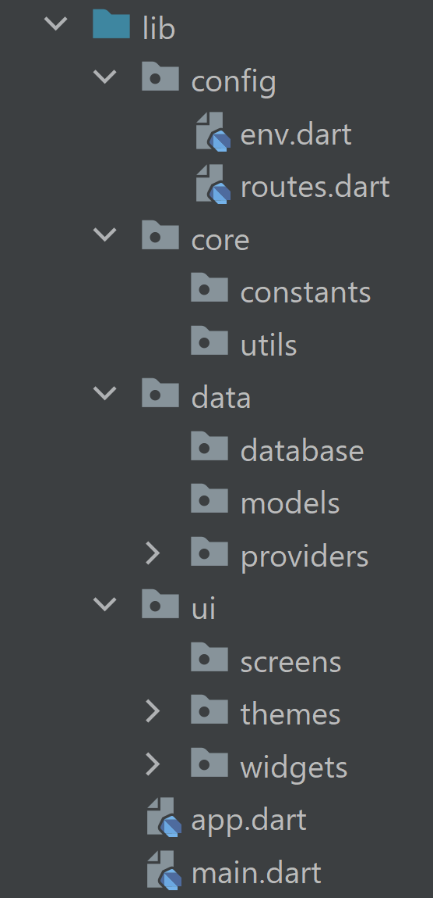

# Flutter Basics

## Create a New App

```
flutter create app_name
```

---

## Basic Folder Structure



---

## Colors

_colors.dart_

```dart
import 'dart:ui';

class DarkPurpleThemeColors {
  static const Color accentPrimary = Color(0xFFB39DDB);
  static const Color accentSecondary = Color(0xFF7E57C2);
  static const Color accentTertiary = Color(0xFF6036AB);
  static const Color backgroundPrimary = Color(0xFF3B3D54);
  static const Color backgroundSecondary = Color(0xFF222338);
  static const Color backgroundTertiary = Color(0xFF1C1D32);
  static const Color foregroundPrimary = Color(0xFFFFFFFF);
  static const Color foregroundSecondary = Color(0xFFE0E0E0);
  static const Color foregroundTertiary = Color(0xFFB1B1B1);
  static const Color highlightRed = Color(0xFFD32F2F);
  static const Color highlightOrange = Color(0xFF388E3C);
  static const Color highlightGreen = Color(0xFFF57C00);
  static const Color highlightGolden = Color(0xFFFFC107);
}

class LightPurpleThemeColors {
  static const Color accentPrimary = Color(0xFFB39DDB);
  static const Color accentSecondary = Color(0xFF7E57C2);
  static const Color accentTertiary = Color(0xFF6036AB);
  static const Color foregroundTertiary = Color(0xFF3B3D54);
  static const Color foregroundSecondary = Color(0xFF222338);
  static const Color foregroundPrimary = Color(0xFF1C1D32);
  static const Color backgroundPrimary = Color(0xFFFFFFFF);
  static const Color backgroundSecondary = Color(0xFFE0E0E0);
  static const Color backgroundTertiary = Color(0xFFB1B1B1);
  static const Color highlightRed = Color(0xFFD32F2F);
  static const Color highlightOrange = Color(0xFF388E3C);
  static const Color highlightGreen = Color(0xFFF57C00);
  static const Color highlightGolden = Color(0xFFFFC107);
}
```

---
  
## App Themes

_app_themes.dart_

```dart
import 'package:flutter/material.dart';
import 'colors.dart';

class AppThemes {
  static final ThemeData darkPurpleTheme = ThemeData(
    colorScheme: ColorScheme.fromSeed(
      seedColor: DarkPurpleThemeColors.accentTertiary,
      brightness: Brightness.dark,
      primary: DarkPurpleThemeColors.accentPrimary,
      secondary: DarkPurpleThemeColors.accentSecondary,
      tertiary: DarkPurpleThemeColors.accentTertiary,
      primaryContainer: DarkPurpleThemeColors.backgroundPrimary,
      secondaryContainer: DarkPurpleThemeColors.backgroundSecondary,
      tertiaryContainer: DarkPurpleThemeColors.backgroundTertiary,
      onPrimaryContainer: DarkPurpleThemeColors.foregroundPrimary,
      onSecondaryContainer: DarkPurpleThemeColors.foregroundSecondary,
      onTertiaryContainer: DarkPurpleThemeColors.foregroundTertiary,
    ),
  );
  static final ThemeData lightPurpleTheme = ThemeData(
    colorScheme: ColorScheme.fromSeed(
      seedColor: LightPurpleThemeColors.accentTertiary,
      brightness: Brightness.light,
      primary: LightPurpleThemeColors.accentPrimary,
      secondary: LightPurpleThemeColors.accentSecondary,
      tertiary: LightPurpleThemeColors.accentTertiary,
      primaryContainer: LightPurpleThemeColors.backgroundPrimary,
      secondaryContainer: LightPurpleThemeColors.backgroundSecondary,
      tertiaryContainer: LightPurpleThemeColors.backgroundTertiary,
      onPrimaryContainer: LightPurpleThemeColors.foregroundPrimary,
      onSecondaryContainer: LightPurpleThemeColors.foregroundSecondary,
      onTertiaryContainer: LightPurpleThemeColors.foregroundTertiary,
    ),
  );
}
```

---


