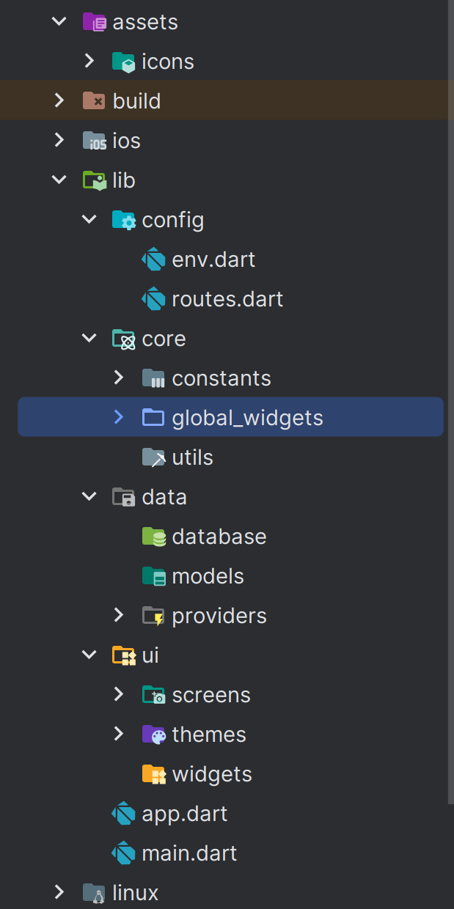

# Development Base (Step 1 - 10).

## Step 1:- Ideas and Concepts.

**App Name** - "Simply Do"

**Idea** - A basic to-do app that will allow user to add task with multiple properties and store detailed analytics and timeline for enhanced productivity.

**Concept**-

- **Add Task** - Simple interface to add new task.
- **Display Tasks** - A clean and organized view of all tasks based on today's tasks, planned tasks, all tasks and completed tasks.
- **Checkbox** - Task can be marked complete or incomplete.
- **Delete Task** - Ability to delete a task.
- **Edit** - Ability to edit a task.
- **Due Date** - Add due date option and view tasks based on that. Tasks with no due date will be only be shown in all tasks and completed(once they are completed).
- **Priority** - Allow users to add priority to a task. Default will be None
- **Notification** - This option will let user to set a time for notification or alarm. By default it will be off.
- **Recurring Tasks** - Tasks can be repeated on daily basis, weekly, monthly, yearly or on custom days. By default it will be Once.
- **Light/Dark Themes** - Option to switch between multiple themes.
- **Widgets** - Option to add widget on home screen.
- **Detailed Timeline** - Detailed timeline panel to show users activity in the app.
- **Analytics** - Detailed analytics for user to understand more about their productivity and timings.

---

## Step 2:- Planning.

### Base Pages -

- **Tasks** - To display tasks.
- **Timeline** - To display detailed timeline.
- **Analytics** - To display detailed analytics.
- **Settings** - For all user settings and options.

### Other Pages -

- **Add Task** - To add a new task.
- **Edit Task** - To edit task.

### Sub Pages/Screens -

- **Tasks:-**
  - My Day (default) - To display all the tasks that are due today.
  - Planned - To display all planned task(where due date is not null).
  - All Tasks - To display all the tasks, planned or unplanned.
  - Completed - To display all the completed tasks.
- **Settings:-**
  - Account - To display settings for Full Name, Username, Google Link.
  - Notification - Daily Notification, Start of Day, End of Day, Email Notification
  - Subscription - Status, Get Premium, Update, Renew
  - Database - Manage All Data, Task Data, Clear Completed Task, Clear Timeline, Clear Analytics, Download Data
  - Support - Contact, Tutorial, Report a bug.


## Step 3:- New Flutter Project.

_Note:- From this step and onwards, we are going to work in flutter. I am using Android Studio on Windows Platform for development but you can use other IDEs as well._

_Note:- This tutorial considers that you already have flutter and Android Studio Installed(You will have to install Android Studio whether you use it for coding or not). Here is a detailed guide for installing flutter and other related applications - https://docs.flutter.dev/get-started/install_

Open a directory where you want to store all your apps, then open command prompt from that directory(right click and choose- Open in Terminal).

Write the following code in terminal -

```
flutter create simply_do
```

If you followed all the steps from the link given above, this command should create a new directory with named - simply_do.

If this doesn't work, you can check flutter by writing `flutter doctor` in command prompt.

If flutter is not found then go back to link above and check every step and don't forget to add flutter bin folder to path variables.

There are bunch of tutorials and documents for this process, you might wanna use one of them.

---

## Step 4:- Basic Folder Structure.

Once your project is created, you should open the directory simply_do in Visual Studio Code or Android Studio. Once open, you will see multiple files and folders, but don't panic, you don't have to work in all of them. Mostly you will be working inside 'lib' folder and we will very rarely touch other folders and files for very specific uses.

Before we start with coding, let's create a basic folder structure for our files, you don't want all of them messed up in one place, do you?

First of all, in our root directory(simply_do), create a folder named - 'assets'. This directory will store all the assets like images, icons, sounds etc. I will also recommend to add separate sub-directory for them when you add them(like icons sub-directory for storing icons). 'assets' is one and only directory that you are going to add in root directory, other than that, every other directory will be added inside lib folder.

Here is the basic structure of lib folder -

lib

- config
  - env.dart
  - routes.dart
- core
  - constants
  - global_widgets
  - utils
- data
  - database
  - models
  - providers
- ui
  - screens
  - themes
  - widgets
- app.dart
- main.dart



_Note:- .dart files are dart files, but all the others are folders and sub-folder._

Now, you have created the folder structure, it's time to know about their use -

'config' folder contains two files related to app configurations-  
'env.dart' file to store environment variables which are basically secret api keys or password that you don't want to share or store in app code.  
'routes.dart' will store all the routes for navigating to one screen to another.

'core' folder contains three sub-folders - 'constants' for storing all the constant variables of app, variables that will stay same and will be used throughout the app.  
'global_widget' for storing all of the widgets that are used globally, a simple rule that I follow is - if a widget is used in more than one screen or page, then it's global.  
'utils' for adding utilities functions, these are helper functions that we will use in app.

'data' folder is mainly associated with storing data. It contains 3 folders - 'database' for storing database related files, we will use sqflite in this app, so we will store files related to that.  
'models' folder will contain all the model classes.  
'providers' will contain all the files related to provider. In case you don't know, provider is basically a state manager throughout the app. For say, you have a variable you changed it's value in one screen, but it is used by other screens too, so for all of the screen to know about these changes, you need an app-wide state manager.

'ui' folder is mostly self-explanatory. It contains three folders, all related to UI.  
'screens' folder will contain all the screens(pages of the app).  
'themes' folder will contain all the files related to themes and colors.  
'widgets' folder will contain all the non-global widgets that are only used in one screen or as a part of other widget.

---

## Step 5:- Decide Colors For The App

This step is not directly related to app development, but it's crucial if you are planning to create a production ready app. Before starting your development process, decide the main colors and theme that you are going to use in the app and store them. Obviously we can adjust or change it later, and we will also create our app in a way that it supports multiple themes if we want to give that option in future.

Primarily, you need to decide four things:

- Your default theme brightness - light or dark
- Your accent color - will be used in specific areas but will provide theme to entire app.
- Your foreground color - a shade of white if brightness is dark and vice versa.
- Your background color - a shade of black if brightness is dark and vice versa.

_Note:- Two really good website to help you with deciding colors ad UI are: https://dribbble.com/ and https://www.behance.net/_

For this app, we have:

- Brightness - dark
- Accent color - deep purple hex code - #6735AC
- Foreground color - shade of white - rgb value - 236, 245, 255
- Background color - shade of black - hex code - #1D1C2C

After you have decided these colors, there is one more thing you need to do. You need to create two more shades of each color, which will make each color in three different shades. Why this? well, because you are not going to use one same color everywhere, there must some difference.

For accent color, create two more shades that are close to accent color. Do the same for background and foreground color.

Now we have 9 colors in total:

- accentPrimary = #6735AC
- accentSecondary = #7E46D9
- accentTertiary = #9180F9
- backgroundPrimary = #1D1C2C
- backgroundSecondary = #34344C
- backgroundTertiary = rgb 35, 37, 53
- foregroundPrimary = rgb 236, 245, 255
- foregroundSecondary = #D9D9D9
- foregroundTertiary = rgb 168, 168, 168

Besides these, you are also going to need some highlight colors for specific uses. In general, you only have three highlight colors - Red, Yellow or Orange and Green. But, you can obviously add more based on your needs.

For this app, we have four highlight colors.

- highlightRed = #C50000
- highlightOrange = #C79C00
- highlightGreen = #3DC000
- highlightGolden = rgb 216, 170, 17

Now we have all the colors that we need for our app(at least for our default theme). It's time to create a constant file and store them in a way that we can use it anywhere we need.

In constants folder, create a new dart file named - 'colors.dart'.

First of all, let's import `dart:ui` to access Color data type.

```dart
import 'dart:ui';
```

Then we will create first abstract class to store all of our Dark Theme One Colors.(You can change the name based on your preference).

```dart
final class DarkThemeOneColors {
  static Color accentPrimary = const Color(0xff6735AC);
  static Color accentSecondary = const Color(0xff7E46D9);
  static Color accentTertiary = const Color(0xff9180F9);
  static Color backgroundPrimary = const Color(0xff1D1C2C);
  static Color backgroundSecondary = const Color(0xff34344C);
  static Color backgroundTertiary = const Color.fromARGB(255, 35, 37, 53);
  static Color foregroundPrimary = const Color.fromARGB(255, 236, 245, 255);
  static Color foregroundSecondary = const Color(0xffD9D9D9);
  static Color foregroundTertiary = const Color.fromARGB(255, 168, 168, 168);
}
```

Now, we will create another abstract class to store highlight colors.

```dart
final class HighlightColors {
  static Color highlightRed = const Color(0xffC50000);
  static Color highlightOrange = const Color(0xffC79C00);
  static Color highlightGreen = const Color(0xff3DC000);
  static Color highlightGolden = const Color.fromARGB(255, 216, 170, 17);
}
```

_Why use static keyword for variables?_
_'static' keyword is used for those variables or methods which belong to the class and not to the instance. Which means, you can directly access them using class name(like `DarkThemeOneColors.accentPrimary`)_

_Why use const keyword?_
_'const' keywords are used in the places where values are known and fixed during the compilation of the app. This helps with optimizing the performance of the app because the compiler can make certain optimizations when it knows that a value will not change._

_What is `Color(0xff3DC000)`?_
_This is a base constructor to initialize a variable of Color data type. It takes hexadecimal value as a parameter. '0x' means it's a hexadecimal value, 'ff' stands for opacity(ff means 100% opaque, 00 means 100% transparent), '3D' is value of red color(61), 'C0' is value of green color(192), and '00' is value of blue(00)_

_What is `Color.fromARGB(255, 216, 170, 17)`?_
_This is named constructor for same color class which is used to initialize Color variable based on ARGB values(alpha, red, green, blue)._

---

## Step 6:- App Default Theme

Now that we know what colors we are going to use in our app, it's time to create a default theme for the app.

_These methods are defined in a way that you can have more than one theme in future and user will have options to choose._

Create a new dart file in themes folder with name 'dark_themes.dart'.

We will use this file to store all the dark themes(for now, only one).

Within it, create a class and static final variable of type ThemeData named 'darkThemeOne'.

```dart
import 'package:flutter/material.dart';
import '../../core/constants/colors.dart';

class DarkThemes {
  static final ThemeData darkThemeOne = ThemeData(
    useMaterial3: true,
    colorScheme: ColorScheme.fromSeed(
        seedColor: DarkThemeOneColors.accentPrimary,
        brightness: Brightness.dark,
        primary: DarkThemeOneColors.accentPrimary,
        secondary: DarkThemeOneColors.accentSecondary,
        tertiary: DarkThemeOneColors.accentTertiary,
        onPrimaryContainer: DarkThemeOneColors.foregroundPrimary,
        onSecondaryContainer: DarkThemeOneColors.foregroundSecondary,
        onTertiaryContainer: DarkThemeOneColors.foregroundTertiary,
        primaryContainer: DarkThemeOneColors.backgroundPrimary,
        secondaryContainer: DarkThemeOneColors.backgroundSecondary,
        tertiaryContainer: DarkThemeOneColors.backgroundTertiary),
  );
}
```

Now create another file in same themes folder named 'app_themes.dart'.

This will be the access point for all the themes in the app. User will select theme from here and later that will be saved in the app memory(shared preferences).

Within 'app_themes.dart', create a class and store first theme data.

```dart
import 'package:flutter/material.dart';
import 'package:simply_do/ui/themes/dark_theme.dart';

final class AppThemes {
  static ThemeData darkThemeOne = DarkThemes.darkThemeOne;
}
```

Now, to access this theme, all we have to do is write `AppThemes.darkThemeOne`.

---

## Step 7:- Saving Basic User Data

Now we know how to add theme to our app, but we can't just hard code it. We have to implement a way so that in future when we have more than one themes, user can select it and store the selection in device memory.

For that, we are going to use a package called 'shared_preferences'.

First of all, let's add the package by writing -

```
flutter pub add shared_preferences
```

Also add provider package by writing -

```
flutter pub add provider
```

Now, let's understand what we are about to do - We are going to create a state-manger using Provider package. This will be responsible for managing state of user data in app-wide scope. This manager is going to connect with shared-preferences to store data and retrieve it. Later we will take that data and use it in our UI.

In 'providers' folder, create a new file called 'app_state.dart'. Within it, let's create a class that will extend from ChangeNotifier and describe few variables in it like 'userName', 'subscriptionStatus' and 'selectedTheme'.

We are also going to use shared_preferences to store these values in device memory, but here is the thing, shared_preferences can only store basic data like String, int, bool, list, etc. So, how are we going to store ThemeData in it? For that, we are gonna have to create a function that will take ThemeData, convert it into related string and then we can save that. And another function that can convert it back when we get that from shared_preferences to use it.

In utils folder, create a helper function - 'theme_to_string.dart'

_theme_to_string.dart_

```dart
import 'package:flutter/material.dart';
import 'package:simply_do/ui/themes/app_themes.dart';

String themeToString(ThemeData themeData) {
  if (themeData == AppThemes.darkThemeOne) {
    return 'darkThemeOne';
  } else {
    return 'darkThemeOne';
  }
}

ThemeData stringToTheme(String? theme) {
  if (theme == 'darkThemeOne') {
    return AppThemes.darkThemeOne;
  } else {
    return AppThemes.darkThemeOne;
  }
}
```

First function converts theme into related String value, and second function converts it back to theme, we have default value to avoid any errors. This might not make much sense right now but once we have multiple themes in future, this is going to come in handy.

Now, back to our 'app_state.dart'.

_app_state.dart_

```dart
import 'dart:async';
import 'package:flutter/material.dart';
import 'package:shared_preferences/shared_preferences.dart';
import 'package:simply_do/core/constants/app_data.dart';
import 'package:simply_do/core/utils/theme_to_string.dart';

class AppState extends ChangeNotifier {

  // Creating late variables, to be initialized later
  late SharedPreferences _prefs;
  late String _userName;
  late bool _subscriptionStatus;
  late ThemeData _selectedTheme = ThemeData.light();

  // Default constructor of the class
  AppState() {
    initializePreferences();
    _checkSubscription();
  }

  // A function to initialize all the variables
  Future<void> initializePreferences() async {
    _prefs = await SharedPreferences.getInstance();
    _userName = _prefs.getString(AppData.userName) ?? 'User';
    _subscriptionStatus = _prefs.getBool(AppData.subscriptionStatus) ?? false;
    _selectedTheme = stringToTheme(_prefs.getString(AppData.selectedTheme));
    await _checkSubscription();
    notifyListeners();
  }

  // Functions related to user name

  String get userName => _userName;

  String get displayUserName =>
      userName.length > 15 ? userName.substring(0, 14) : userName;

  Future<void> updateUserName(String name) async {
    await _prefs.setString(AppData.userName, name);
    notifyListeners();
  }

  // Functions related to subscription status

  bool get isSubscribed => _subscriptionStatus;

  Future<void> _checkSubscription() async {
    // TODO: Check sub from server
  }

  Future<void> updateSubscription(bool isSubscribed) async {
    await _prefs.setBool(AppData.subscriptionStatus, isSubscribed);
    notifyListeners();
  }

  // Functions related to theme data

  ThemeData get selectedTheme => _selectedTheme;

  Future<void> updateTheme(ThemeData theme) async {
    await _prefs.setString(AppData.selectedTheme, themeToString(theme));
    notifyListeners();
  }
}
```

To get data from here, we will use -

```dart
Provider.of<AppState>(context).displayUserName;
Provider.of<AppState>(context).isSubscribed;
Provider.of<AppState>(context).selectedTheme;
```

To update data -

```dart
Provider.of<AppState>(context, listen:false).updateUserName('Name of User');
Provider.of<AppState>(context, listen:false).updateSubscription(true);
Provider.of<AppState>(context, listen:false).updateTheme(themeName);
```

_When to use listen:false?_
_You want to use listen false where you only want to access some data or function but noe want to watch for that data changing in real time. When you want to look for data changing in real time, don't use listen:false, default is true._

For eg. We want to look for any changes in display name or, subscription status or selected theme, that's why we are not using listen: false, but in second scenario, we are only accessing functions to update data, these functions won't change so we don't need to listen to them.

# Add Task (Step 11 - 20).

---

# Display Task (Step 21 - 30).

---

#
