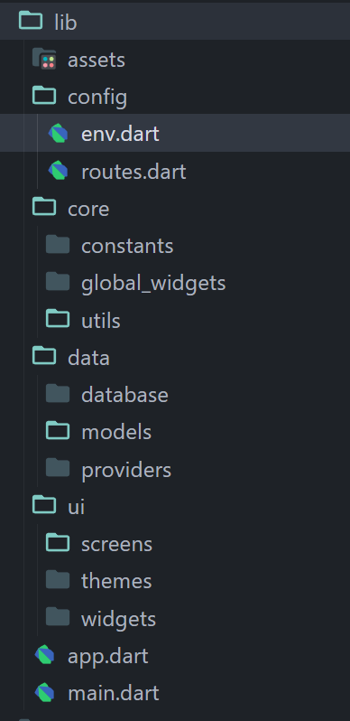
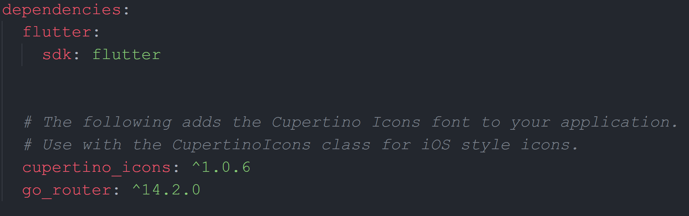
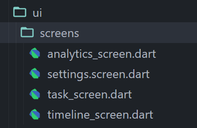

# Simply Do

A basic to-do app for adding everyday task.  
USP - Simple User Interface with all the basic functionalities.

## Ideas and Concepts:-

1. **Add Task**:- Simple interface to add task.
2. **View Task**:- A clean and organised view of all the tasks.
3. **Checkbox**:- Ability to mark complete or incomplete.
4. **Delete**:- Ability to delete a task.
5. **Edit**:- Ability to eidt a task.
6. **Due Date**:- Add due date and view task based on that. Also have unplanned task(with no due dates).
7. **Priority**:- Ability to set priority of a task.
8. **Reminders/Notification**:- A reminder at the starting of day to remind user for number of task he/she has planned for today. Ability to set reminder for each task.
9. **Recurring Tasks**:- Task can be repeated daily, weekly, monthly or custom days.
10. **Light/Dark Theme**:- Option to switch between multiple themes.
11. **Widgets**:- Widget for home screen.
12. **Timeline**:- A specific tab for all the activities done so far.
13. **Analytics**:- A detailed analytics page.

---

## Planning:-

- **Sidebar** contains User Profile Info(if set) and links to different pages. Those pages will be Tasks(default page), Timeline, Analytics, Profile, Premium, Contact and Other Apps.
- **Task Page** appbar at the top with title in middle and premium option at right. In bottomAppBar, 4 options - My Day, Planned, All, Completed. Floating action button will allow to add new task.
- **My Day** will contain all the tasks due today sorted according to priorities.
- **Planned** will contain all the tasks that is planned for some date. They will be sorted by date with date dropdown tag and then for each date, sorted by priorities.
- **All** will contain all the incomplete tasks, planned or otherwise. First Unplanned with dropdown tag and then planned with date dropdown tag.
- **Completed** will contain all the completed task. Users can mark them incomplete, or clear them all with a clear tag on the top.
- **Timeline** page will contain a timeline of all the activities that are performed. New task added, task completed, marked incomplete etc.
- **Analytics** page will contain a detailed analysis of percentage and number of task completed everyday(graph), average, most productive day, most productive hours(divided in the slot of three hours).
- **Settings** page will contain options related to profiles and settings. These options are Profile Info - Username, email, Notifications options(start of the day time). Email notifications(if possible - for premium), Subscription and Billing,Themes(premium), Database management - Clear all data, Clear all tasks, Clear timeline, clear analytics. Support - Contact.

---


## Design

### Base Color Palette -

```dart
Color accentPrimary = const Color(0xff6735AC);
    Color accentSecondary = const Color(0xff7E46D9);
    Color accentTertiary = const Color(0xff9180F9);
    Color backgroundPrimary = const Color(0xff1D1C2C);
    Color backgroundSecondary = const Color(0xff34344C);
    Color backgroundTertiary = Color.fromARGB(255, 35, 37, 53);
    Color foregroundPrimary = Color.fromARGB(255, 236, 245, 255);
    Color foregroundSecondary = const Color(0xffD9D9D9);
    Color foregroundTertiary = Color.fromARGB(255,  );
```

---

## Development

### Create App Project:-

Choose a dedicated development software and open command prompt from the folder and runt this command-

```
flutter create simply_do
```

- This will create a folder with the name 'simply_do'.
- Open the folder in VS code or any editor of your choice.
- Find the lib folder, this is where we are going to store all development files.
- Inside lib folder, you will see main.dart, this is the starting point of your app.

---

### Run App on Emulator:-

_Note: This step will require Android emulator to be installed through android studio._

- In VS code, type in search bar - >flutter then select Flutter: Launch Emulator.
- After emulator is successfully launched, go to your main.dart file and execute it.
- Now you will see flutter demo project on your emulator, something like this-


### Creating intitial setup for our app:-

- Step 1: Remove all the default code from the main.dart file.
- Step 2: Import material package - this package contains all the useful tools and widgets that we use in flutter.

```dart
import 'package:flutter/material.dart';
```

- Step 3: Create main function - this is the entry point of the app, this is what we will execute to run the app.

```dart
void main() {
  runApp(const MyAppp());
}
```

Let me guess, it's showing error, it's because we are trying to execute MyApp() class but we haven't created it yet.

- Step 4: Create a StatelessWidget Class named MyApp.

```dart
class MyAppp extends StatelessWidget {
  const MyAppp({super.key});

  @override
  Widget build(BuildContext context) {
    return const Placeholder();
  }
}
```

**StatelessWidget and StatefulWidget**  
In flutter we are mostly going ot work with two types of classes, StatelessWidget class and StatefulWidget class, they both return Widgets which will show in UI(user interface). So, what's the difference?  
To understand the diference, first we need to understand what state is- it's something similar as what we studied in school about three staes of matter- solid, liquid and gas(btw, there are 32 states of matter but they dont't teach us all of that, I am glad).
Anyway, same as maater, state of widget is just how it apppears, StatelessWidgets are the one which doesn't change their state such as some text on screen which will stay exactly the same, whereas StatefulWidgets are the ones which change their state over time or on some actions like button press.For eg. let say there is a number on screen and a button, and when you press that button, the number will increase, in this case, the state of text widget is changing on action, i.e StatefulWidget.

Right now, this is our main.dart file so far -

```dart
import 'package:flutter/material.dart';

void main() {
  runApp(const MyAppp());
}

class MyAppp extends StatelessWidget {
  const MyAppp({super.key});

  @override
  Widget build(BuildContext context) {
    return const Placeholder();
  }
}
```

If you run the app now, it won't show anything because our app is returning a placeholder which is, well nothing.

- Step 5: Create project structure - Before we move forward with more programming, let create a structure for our project.

Inside lib folder, create these folders/files as shown -



_Note: app.dart and main.dart are directly inside the lib folder(not inside any subfolders)._

Even though the name suggests it all, let's have a look for what these files and folders will be used for.

**main.dart**- THe entry point of the app with main function.  
**app.dart**- MyApp class that we will execute in main function.  
**assets folder**- Will contain all the assetas like images or sounds or videos.  
**env.dart**- Will contain environment variables such as App Name, API url or variables etc.  
**routes.dart**- Will contain all the routes to pages or screens in the app.  
**constants**- Will contain all the constants of the app like String constants, Color constants, Routes names etc.  
**global_widgets**- Contains all the widgets that will be used app wide.  
**utils**- All the utility or helper functions like conversions etc.  
**database**- Contains database related files.  
**models**- Contains all the model classes to define the structure.  
**providers**- All the providers related files to manage app wide state.  
**screens**- All the different screens of the app.  
**themes**- All the themes used in the app.  
**widgets**- Contains screen spefcific widgets, not app wide.

- Step 6: Move MyApp Class from main.dart to app.dart and import it in main.dart. Don't forget to import material package in app.dart. You are going to need this package in every single file that uses flutter widgets.

Now our code will look something like this-

_app.dart_

```dart
import 'package:flutter/material.dart';

class MyAppp extends StatelessWidget {
  const MyAppp({super.key});

  @override
  Widget build(BuildContext context) {
    return const Placeholder();
  }
}
```

_main.dart_

```dart
import 'package:flutter/material.dart';
import 'package:simply_do/app.dart';

void main() {
  runApp(const MyAppp());
}
```

---

### Adding Screens

- Step 7: In constants folder, create a file 'screen_names.dart'.
- Step 8: Add all the names of screens here, for now only four(will add more later).

_screen_names.dart_

```dart
abstract final class ScreenNames{
  static const tasks = '/';
  static const timeline = '/timeline';
  static const analytics = '/analytics';
  static const settings = '/settings';
}
```

Why create this?  
For routing(switching from one screen to another), we are going to use an external package called 'go_router'. Now, we can directly use the string name in go_router like '/timeline', but using it throughout app will make it more prone to errors, that's why we are storing it as a variable in abstract class, now whenever we need to use it, we can simply write - ScreenNames.timeline

---

### Adding go_router

- Step 9: Open the terminal in VS code and write the following code -

```
flutter pub add go_router
```

And press Enter. This will take few seconds to add go_router package.

- Step 10: To check if the package is successfully added or not, go to 'pubspec.yaml'(you will find this file the main app directory). Inside the file, scroll down to where it says - 'dependencies:', you should see something like this -



If you see go_router there, it means the package is successfully added.

---

### Creating all the screens

- Step 11: Right now, we have to add four screens to our route, for that we need to create these sceen widget classes. Navigate to the screens folder in ui and create four different files -



- Step 12: Create basic Stateless Widget class for each screens.

_analytics_screen.dart_

```dart
import 'package:flutter/material.dart';

class AnalyticsScreen extends StatelessWidget {
  const AnalyticsScreen({super.key});

  @override
  Widget build(BuildContext context) {
    return const Placeholder();
  }
}
```

_settings_screen.dart_

```dart
import 'package:flutter/material.dart';

class SettingsScreen extends StatelessWidget {
  const SettingsScreen({super.key});

  @override
  Widget build(BuildContext context) {
    return const Placeholder();
  }
}
```

_task_screen.dart_

```dart
import 'package:flutter/material.dart';

class TaskScreen extends StatelessWidget {
  const TaskScreen({super.key});

  @override
  Widget build(BuildContext context) {
    return const Placeholder();
  }
}
```

_timeline_screen.dart_

```dart
import 'package:flutter/material.dart';

class TimelineScreen extends StatelessWidget {
  const TimelineScreen({super.key});

  @override
  Widget build(BuildContext context) {
    return const Placeholder();
  }
}
```

_Note: A minor change - rename task_screen.dart to tasks_screen.dart and TaskScreen class to TasksScreen class._

- Step 13: Create an UnknownPage too, incase user it directed to page that doesn't exist.

_unknown_screen.dart_

```dart
import 'package:flutter/material.dart';
import 'package:simply_do/core/constants/screen_names.dart';

class UnknownScreen extends StatelessWidget {
  const UnknownScreen({super.key});

  @override
  Widget build(BuildContext context) {
    return Scaffold(
      appBar: AppBar(
        title: const Text('Unknown Route'),
      ),
      body: Center(
        child: Column(
          mainAxisAlignment: MainAxisAlignment.center,
          children: [
            const Text('Page does not exist'),
            const SizedBox(height: 20),
            ElevatedButton(
              onPressed: () {
                context.goNamed(ScreenNames.tasks);
              },
              child: const Text('Go to Home'),
            ),
          ],
        ),
      ),
    );
  }
}
```

This is a basic screen to show that the page does not exist and a button to go back to home page.

---

### Using go_router

- Step 14: Go to the routes.dart file inside config folder, we are going to write all the router related code here.

_routes.dart_

```dart
import 'package:flutter/material.dart';
import 'package:go_router/go_router.dart';
import 'package:simply_do/core/constants/screen_names.dart';
import 'package:simply_do/ui/screens/analytics_screen.dart';
import 'package:simply_do/ui/screens/settings.screen.dart';
import 'package:simply_do/ui/screens/tasks_screen.dart';
import 'package:simply_do/ui/screens/timeline_screen.dart';
import 'package:simply_do/ui/screens/unknown_screen.dart';

final router = GoRouter(
  initialLocation: '/',
  debugLogDiagnostics: true,
  routes: [
    GoRoute(
      name: ScreenNames.tasks,
      path: ScreenNames.tasks,
      builder: (context, state) => const TasksScreen(),
    ),
    GoRoute(
      name: ScreenNames.timeline,
      path: ScreenNames.timeline,
      builder: (context, state) => const TimelineScreen(),
    ),
    GoRoute(
      name: ScreenNames.analytics,
      path: ScreenNames.analytics,
      builder: (context, state) => const AnalyticsScreen(),
    ),
    GoRoute(
      name: ScreenNames.settings,
      path: ScreenNames.settings,
      builder: (context, state) => const SettingsScreen(),
    )
  ],
  errorPageBuilder: (context, state) {
    return const MaterialPage(child: UnknownScreen());
  },
);
```

---

### Implementing router in MyApp

- Step 15: Change app.dart to implement router -

```dart
import 'package:flutter/material.dart';
import 'package:simply_do/config/routes.dart';

class MyAppp extends StatelessWidget {
  const MyAppp({super.key});

  @override
  Widget build(BuildContext context) {
    return MaterialApp.router(
      routerConfig: router,
      debugShowCheckedModeBanner: false,
    );
  }
}
```

---

### Implementing Provider

Provider is used to manage app wide state.

- Step 16: Open the terminal and write the following code to add provider.

```
flutter pub add provider
```

- Step 17: Implement provider in app.dart -

_app.dart_

```dart
import 'package:flutter/material.dart';
import 'package:provider/provider.dart';
import 'package:simply_do/config/routes.dart';

class MyAppp extends StatelessWidget {
  const MyAppp({super.key});

  @override
  Widget build(BuildContext context) {
    return MultiProvider(
      providers: [],
      child: MaterialApp.router(
        routerConfig: router,
        debugShowCheckedModeBanner: false,
      ),
    );
  }
}
```

We will add providers as we go.

---

### Adding an AppState Provider

- Step 18: In providers folder, create a file- app_state.dart and write the following code inside -

```dart
import 'package:flutter/widgets.dart';

class AppState extends ChangeNotifier{

}
```

- Step 19: Add this to providers list in app.dart

```dart
providers: [
        ChangeNotifierProvider(create: (_) => AppState()),
      ],
```

### Working on our first page - task_screen.dart

- Step 20: Create a basic layout for TaskScreen

```dart
import 'package:flutter/material.dart';

class TasksScreen extends StatelessWidget {
  const TasksScreen({super.key});

  @override
  Widget build(BuildContext context) {
    return Scaffold(
      appBar: AppBar(
        toolbarHeight: 65,
        title: const Text('My Day'),
        centerTitle: true,
      ),
      drawer: ,
      body: ,
      bottomNavigationBar: ,
      floatingActionButton: ,
      floatingActionButtonLocation: FloatingActionButtonLocation.centerDocked,
    );
  }
}
```

_I know it's showing multiple error and it's because we still have to create and then add widgets for drawer, body, bottomNavigationBar, and floatingActionBar_

---

### Creating Colors, Fonts and Theme -

- Step 21: Before we move forward with anything else, let's create our app themes and colors. Go to the themes folder and create a file named - colors.dart

- Step 22: Create an abstract class for darkThemeOne and define all the colors.

```dart
import 'package:flutter/material.dart';

abstract final class DarkThemeOne {
  static Color accentPrimary = const Color(0xff6735AC);
  static Color accentSecondary = const Color(0xff7E46D9);
  static Color accentTertiary = const Color(0xff9180F9);
  static Color backgroundPrimary = const Color(0xff1D1C2C);
  static Color backgroundSecondary = const Color(0xff34344C);
  static Color backgroundTertiary = const Color.fromARGB(255, 35, 37, 53);
  static Color foregroundPrimary = const Color.fromARGB(255, 236, 245, 255);
  static Color foregroundSecondary = const Color(0xffD9D9D9);
  static Color foregroundTertiary = const Color.fromARGB(255, 168, 168, 168);
  static Color highlightOne = const Color(0xffC50000);
  static Color highlightTwo = const Color(0xffC79C00);
  static Color highlightThree = const Color(0xff3DC000);
}

abstract final class HighlightColors {
  static Color highlightRed = const Color(0xffC50000);
  static Color highlightOrange = const Color(0xffC79C00);
  static Color highlightGreen = const Color(0xff3DC000);
  static Color highlightGolden = const Color.fromARGB(255, 216, 170, 17);
}

```

- Step 23: Create another file in the same folder for themes - app_themes.dart

We will define all our themes here.

For now, let's define all the colors from colors.dart -

_app_themes.dart_

```dart
import 'package:flutter/material.dart';
import 'package:simply_do/ui/themes/colors.dart';

abstract final class AppThemes {
  static ThemeData darkThemeOne() {
    return ThemeData(
      useMaterial3: true,
      colorScheme: ColorScheme.fromSeed(
        seedColor: DarkThemeOne.accentPrimary,
        brightness: Brightness.dark,
        primary: DarkThemeOne.accentPrimary,
        secondary: DarkThemeOne.accentSecondary,
        tertiary: DarkThemeOne.accentTertiary,
        onPrimaryContainer: DarkThemeOne.foregroundPrimary,
        onSecondaryContainer: DarkThemeOne.foregroundSecondary,
        onTertiaryContainer: DarkThemeOne.foregroundTertiary,
        primaryContainer: DarkThemeOne.backgroundPrimary,
        secondaryContainer: DarkThemeOne.backgroundSecondary,
        tertiaryContainer: DarkThemeOne.backgroundTertiary,
      ),
    );
  }
}
```

- Step 24: Let's define current theme as selected theme. For that, open app_state.dart in provider folder and write the following code -

```dart
import 'package:flutter/material.dart';
import 'package:simply_do/ui/themes/app_themes.dart';

class AppState extends ChangeNotifier {
  // theme
  ThemeData _selectedTheme = AppThemes.darkThemeOne();

  ThemeData get selectedTheme => _selectedTheme;

  void updateSelectedTheme(ThemeData theme) {
    _selectedTheme = theme;
    notifyListeners();
  }
}
```

Basic code to set,get and store selected theme.

Step 25: Now let's use this data in app.dart to change the theme of our app.

```dart
class MyAppp extends StatelessWidget {
  const MyAppp({super.key});

  @override
  Widget build(BuildContext context) {
    return MultiProvider(
      providers: [
        ChangeNotifierProvider(create: (_) => AppState()),
        ChangeNotifierProvider(create: (_) => TasksScreenState()),
      ],
      child: Builder(builder: (context) {
        final appState = context.watch<AppState>();
        return MaterialApp.router(
          routerConfig: router,
          debugShowCheckedModeBanner: false,
          theme: appState.selectedTheme,
        );
      }),
    );
  }
}
```

- Step 26: In our app, we are also going to need custom text styles, for that, let's create a text_widgets.dart file in global widgets. Here we will store all the text types that we will use through out the app, so that we don't have to create them again and again.

_text_widgets.dart_

```dart
import 'package:flutter/material.dart';

class LargeTitle extends StatelessWidget {
  const LargeTitle({
    super.key,
    required this.text,
    this.textColor,
    this.fontSize = 34,
  });

  final String text;
  final Color? textColor;
  final double fontSize;

  @override
  Widget build(BuildContext context) {
    textColor ?? Theme.of(context).colorScheme.onPrimaryContainer;
    return Text(
      text,
      style: TextStyle(
        fontSize: fontSize,
        color: textColor,
      ),
    );
  }
}

class BigTitle extends StatelessWidget {
  const BigTitle({
    super.key,
    required this.text,
    this.textColor,
    this.fontSize = 28,
  });

  final String text;
  final Color? textColor;
  final double fontSize;

  @override
  Widget build(BuildContext context) {
    textColor ?? Theme.of(context).colorScheme.onPrimaryContainer;
    return Text(
      text,
      style: TextStyle(
        fontSize: fontSize,
        color: textColor,
      ),
    );
  }
}

class MediumTitle extends StatelessWidget {
  const MediumTitle({
    super.key,
    required this.text,
    this.textColor,
    this.fontSize = 22,
  });

  final String text;
  final Color? textColor;
  final double fontSize;

  @override
  Widget build(BuildContext context) {
    textColor ?? Theme.of(context).colorScheme.onPrimaryContainer;
    return Text(
      text,
      style: TextStyle(
        fontSize: fontSize,
        color: textColor,
      ),
    );
  }
}

class SmallTitle extends StatelessWidget {
  const SmallTitle({
    super.key,
    required this.text,
    this.textColor,
    this.fontSize = 20,
  });

  final String text;
  final Color? textColor;
  final double fontSize;

  @override
  Widget build(BuildContext context) {
    textColor ?? Theme.of(context).colorScheme.onPrimaryContainer;
    return Text(
      text,
      style: TextStyle(
        fontSize: fontSize,
        color: textColor,
      ),
    );
  }
}

class Headline extends StatelessWidget {
  const Headline({
    super.key,
    required this.text,
    this.textColor,
    this.fontSize = 17,
  });

  final String text;
  final Color? textColor;
  final double fontSize;

  @override
  Widget build(BuildContext context) {
    textColor ?? Theme.of(context).colorScheme.onPrimaryContainer;
    return Text(
      text,
      style: TextStyle(
          fontSize: fontSize, color: textColor, fontWeight: FontWeight.w600),
    );
  }
}

class BigBody extends StatelessWidget {
  const BigBody({
    super.key,
    required this.text,
    this.textColor,
    this.fontSize = 17,
  });

  final String text;
  final Color? textColor;
  final double fontSize;

  @override
  Widget build(BuildContext context) {
    textColor ?? Theme.of(context).colorScheme.onPrimaryContainer;
    return Text(
      text,
      style: TextStyle(
        fontSize: fontSize,
        color: textColor,
      ),
    );
  }
}

class SmallBody extends StatelessWidget {
  const SmallBody({
    super.key,
    required this.text,
    this.textColor,
    this.fontSize = 16,
  });

  final String text;
  final Color? textColor;
  final double fontSize;

  @override
  Widget build(BuildContext context) {
    textColor ?? Theme.of(context).colorScheme.onPrimaryContainer;
    return Text(
      text,
      style: TextStyle(
        fontSize: fontSize,
        color: textColor,
      ),
    );
  }
}

class Subhead extends StatelessWidget {
  const Subhead({
    super.key,
    required this.text,
    this.textColor,
    this.fontSize = 15,
  });

  final String text;
  final Color? textColor;
  final double fontSize;

  @override
  Widget build(BuildContext context) {
    textColor ?? Theme.of(context).colorScheme.onPrimaryContainer;
    return Text(
      text,
      style: TextStyle(
        fontSize: fontSize,
        color: textColor,
      ),
    );
  }
}

class FootNote extends StatelessWidget {
  const FootNote({
    super.key,
    required this.text,
    this.textColor,
    this.fontSize = 13,
  });

  final String text;
  final Color? textColor;
  final double fontSize;

  @override
  Widget build(BuildContext context) {
    textColor ?? Theme.of(context).colorScheme.onPrimaryContainer;
    return Text(
      text,
      style: TextStyle(
        fontSize: fontSize,
        color: textColor,
      ),
    );
  }
}

class BigCaption extends StatelessWidget {
  const BigCaption({
    super.key,
    required this.text,
    this.textColor,
    this.fontSize = 12,
  });

  final String text;
  final Color? textColor;
  final double fontSize;

  @override
  Widget build(BuildContext context) {
    textColor ?? Theme.of(context).colorScheme.onPrimaryContainer;
    return Text(
      text,
      style: TextStyle(
        fontSize: fontSize,
        color: textColor,
      ),
    );
  }
}

class SmallCaption extends StatelessWidget {
  const SmallCaption({
    super.key,
    required this.text,
    this.textColor,
    this.fontSize = 11,
  });

  final String text;
  final Color? textColor;
  final double fontSize;

  @override
  Widget build(BuildContext context) {
    textColor ?? Theme.of(context).colorScheme.onPrimaryContainer;
    return Text(
      text,
      style: TextStyle(
        fontSize: fontSize,
        color: textColor,
      ),
    );
  }
}
```

These are 11 different types of texts that we are going to use throughout the app.

### Creating Drawer

- Step 27: It's time to start working on our task_screen.dart again and let's create drawer for our screen. In global_widgets folder, add a new file named - drawer_widget.dart

- Step 28: We are going to use some user data in our drawer which we will access through app_state.dart, so let's write down those data.

_app_state.dart_

```dart
// After theme


  //user data

  String _userName = 'Aditya Anand';

  String get userName => _userName;

  String get visibleUserName {
    return _userName.length > 15 ? _userName.substring(0, 15) : _userName;
  }

  void updateUserName(String name) {
    _userName = name;
    // TODO: Save in shared preferences
    notifyListeners();
  }

  // Subscription Type

  bool _isPremiumSubscriber = true;

  bool get isPremiumSubscriber => _isPremiumSubscriber;

  void updateUserSubscription(bool isSubscribed){
    _isPremiumSubscriber = isSubscribed;
    // TODO: Change subscription status in online.
    notifyListeners();
  }
```

- Step 29: We are also going to use svg icon in our drawer, for that we need to install svg package - In terminal, write the following command -

```
flutter pub add flutter_svg
```

_Note: Before moving forward, let's correct a tiny mistake, right now our asset folder is inside lib folder, but it is supposed to be in root folder, so just drag it outside in root folder, make sure you don't drag is it in another folder._

- Step 30: Create a new folder inside assets folder - icons.

- Step 31: Download svg crown icon from - https://remixicon.com/icon/vip-crown-2-fill

- Step 32: Add icon folder to pubspec.yaml - Open pubspec.yaml and scroll to the commented section of assets and replace it like this

```yaml
flutter:
  # The following line ensures that the Material Icons font is
  # included with your application, so that you can use the icons in
  # the material Icons class.
  uses-material-design: true

  # To add assets to your application, add an assets section, like this:
  assets:
    - assets/icons/
```

- Step 33: We need two new state management files in provider folder, one to manage state of the selected page, and one to manage state of task category selected. Let's create two files named - page_state.dart and tasks_screen_state.dart inside provider folder.

- Step 34: Add these two new providers to app.dart file like this -

```dart
providers: [
        ChangeNotifierProvider(create: (_) => AppState()),
        ChangeNotifierProvider(create: (_) => TasksScreenState()),
        ChangeNotifierProvider(create: (_) => PageState()),
      ],
```

- Step 35: Inside page_state.dart file, add a new class named - PageState and add code to manage page state like this -

```dart
import 'package:flutter/material.dart';
import 'package:simply_do/core/constants/screen_names.dart';

class PageState extends ChangeNotifier {
  String _selectedPage = ScreenNames.tasks;

  String get selectedPage => _selectedPage;

  void updateSelectedPage(String pageName) {
    _selectedPage = pageName;
    notifyListeners();
  }
}
```

- Step 36: Finally, write code in drawer_widget.dart file like this to show a drawer-

```dart
import 'package:flutter/material.dart';
import 'package:flutter_svg/flutter_svg.dart';
import 'package:go_router/go_router.dart';
import 'package:provider/provider.dart';
import 'package:simply_do/core/constants/screen_names.dart';
import 'package:simply_do/core/global_widgets/text_widgets.dart';
import 'package:simply_do/data/providers/app_state.dart';
import 'package:simply_do/data/providers/page_state.dart';
import 'package:simply_do/ui/themes/colors.dart';

class DrawerWidget extends StatelessWidget {
  const DrawerWidget({super.key});

  @override
  Widget build(BuildContext context) {
    var themeColor = Theme.of(context).colorScheme;
    var appState = Provider.of<AppState>(context, listen: false);
    var pageState = Provider.of<PageState>(context, listen: false);
    return Drawer(
      backgroundColor: themeColor.primaryContainer,
      child: ListView(
        padding: const EdgeInsets.all(0),
        children: [
          DrawerHeader(
            decoration: BoxDecoration(
              color: themeColor.secondaryContainer,
            ),
            child: Row(
              crossAxisAlignment: CrossAxisAlignment.center,
              children: [
                CircleAvatar(
                  backgroundColor: themeColor.tertiaryContainer,
                  radius: 30,
                  child: appState.isPremiumSubscriber
                      ? SvgPicture.asset(
                          'assets/icons/crown.svg',
                          width: 30,
                          fit: BoxFit.fill,
                          colorFilter: ColorFilter.mode(
                            HighlightColors.highlightGolden,
                            BlendMode.srcIn,
                          ),
                        )
                      : const Icon(
                          Icons.person,
                          size: 30,
                        ),
                ),
                const SizedBox(
                  width: 16,
                ),
                Column(
                  mainAxisAlignment: MainAxisAlignment.center,
                  crossAxisAlignment: CrossAxisAlignment.start,
                  children: [
                    Consumer<AppState>(
                      builder: (context, appState, child) {
                        return MediumTitle(text: appState.visibleUserName);
                      },
                    ),
                    Consumer<AppState>(
                      builder: (context, appState, child) {
                        return Subhead(
                          text: appState.isPremiumSubscriber
                              ? 'Premium User'
                              : 'Normal User',
                          textColor: appState.isPremiumSubscriber
                              ? HighlightColors.highlightGolden
                              : themeColor.onPrimaryContainer,
                        );
                      },
                    ),
                  ],
                )
              ],
            ),
          ),
          ListTile(
            title: SmallTitle(
              text: 'Tasks',
              textColor: pageState.selectedPage == ScreenNames.tasks
                  ? themeColor.secondary
                  : themeColor.onPrimaryContainer,
            ),
            onTap: () {
              Navigator.pop(context);
              context.goNamed(ScreenNames.tasks);
              pageState.updateSelectedPage(ScreenNames.tasks);
            },
          ),
          ListTile(
            title: SmallTitle(
              text: 'Timeline',
              textColor: pageState.selectedPage == ScreenNames.timeline
                  ? themeColor.secondary
                  : themeColor.onPrimaryContainer,
            ),
            onTap: () {
              Navigator.pop(context);
              context.goNamed(ScreenNames.timeline);
              pageState.updateSelectedPage(ScreenNames.timeline);
            },
          ),
          ListTile(
            title: SmallTitle(
              text: 'Analytics',
              textColor: pageState.selectedPage == ScreenNames.analytics
                  ? themeColor.secondary
                  : themeColor.onPrimaryContainer,
            ),
            onTap: () {
              Navigator.pop(context);
              context.goNamed(ScreenNames.analytics);
              pageState.updateSelectedPage(ScreenNames.analytics);
            },
          ),
          const Divider(),
          ListTile(
            title: SmallTitle(
              text: 'Premium',
              textColor: themeColor.onPrimaryContainer,
            ),
            onTap: () {
              Navigator.pop(context);
              // TODO: Switch to premium page
            },
          ),
          ListTile(
            title: SmallTitle(
              text: 'Settings',
              textColor: themeColor.onPrimaryContainer,
            ),
            onTap: () {
              Navigator.pop(context);
              // TODO: Switch to settings page
            },
          ),
          ListTile(
            title: SmallTitle(
              text: 'Tutorial',
              textColor: themeColor.onPrimaryContainer,
            ),
            onTap: () {
              Navigator.pop(context);
              // TODO: Switch to tutorial page
            },
          ),
          ListTile(
            title: SmallTitle(
              text: 'Support',
              textColor: themeColor.onPrimaryContainer,
            ),
            onTap: () {
              Navigator.pop(context);
              // TODO: Switch to support page
            },
          ),
        ],
      ),
    );
  }
}
```

---

### Creating BottomAppBar

- Step 37: Create a new file in widgets folder(not in global_widgets) - bottom_app_bar_widget.dart

- Step 38: Add code to task_screen_state.dart to set the screen state and function to update it.

```dart
import 'package:flutter/material.dart';

class TasksScreenState extends ChangeNotifier {
  int _selectedTasksScreen = 0;

  int get selectedTasksScreen => _selectedTasksScreen;

  void updateSelectedTasksScreen(int screenIndex) {
    _selectedTasksScreen = screenIndex;
    notifyListeners();
  }
}
```

- Step 39: Add code to create bottom app bar in bottom_app_bar_widget.dart -

```dart
import 'package:flutter/material.dart';
import 'package:provider/provider.dart';
import 'package:simply_do/data/providers/tasks_screen_state.dart';

class BottomAppBarWidget extends StatelessWidget {
  const BottomAppBarWidget({super.key});

  @override
  Widget build(BuildContext context) {
    var taskScreenState = Provider.of<TasksScreenState>(context);
    return BottomAppBar(
      height: 60,
      padding: EdgeInsets.zero,
      shape: const CircularNotchedRectangle(),
      notchMargin: 10,
      clipBehavior: Clip.antiAlias,
      child: BottomNavigationBar(
        onTap: (value) {
          if (value != 2) {
            taskScreenState.updateSelectedTasksScreen(value);
          }
        },
        currentIndex: taskScreenState.selectedTasksScreen,
        iconSize: 25,
        type: BottomNavigationBarType.fixed,
        backgroundColor: Theme.of(context).colorScheme.secondaryContainer,
        showSelectedLabels: false,
        showUnselectedLabels: false,
        selectedIconTheme:
            IconThemeData(color: Theme.of(context).colorScheme.tertiary),
        unselectedIconTheme: IconThemeData(
            color: Theme.of(context).colorScheme.onPrimaryContainer),
        items: const [
          BottomNavigationBarItem(
            icon: Icon(Icons.sunny),
            label: 'My Day',
          ),
          BottomNavigationBarItem(
            icon: Icon(Icons.calendar_month),
            label: 'Planned',
          ),
          BottomNavigationBarItem(
            icon: Icon(
              Icons.sunny,
              color: Colors.transparent,
            ),
            label: 'My Day',
          ),
          BottomNavigationBarItem(
            icon: Icon(Icons.format_list_bulleted),
            label: 'All Task',
          ),
          BottomNavigationBarItem(
            icon: Icon(Icons.task_alt),
            label: 'Completed',
          )
        ],
      ),
    );
  }
}
```

- Step 40: Create floating bar in widgets folder. - floating_action_button_widget.dart

```dart
import 'package:flutter/material.dart';

class FloatingActionButtonWidget extends StatelessWidget {
  const FloatingActionButtonWidget({super.key});

  @override
  Widget build(BuildContext context) {
    return FloatingActionButton(
      backgroundColor: Theme.of(context).colorScheme.primary,
      onPressed: () {
        // TODO: Go to add task page
      },
      shape: const CircleBorder(),
      child: const Icon(Icons.add),
    );
  }
}
```

- Step 41: Now finally add all these widgets to task_screen.dart

```dart
import 'package:flutter/material.dart';
import 'package:simply_do/core/global_widgets/drawer_widget.dart';
import 'package:simply_do/ui/widgets/bottom_app_bar_widget.dart';
import 'package:simply_do/ui/widgets/floating_action_button_widget.dart';

class TasksScreen extends StatelessWidget {
  const TasksScreen({super.key});

  @override
  Widget build(BuildContext context) {
    return Scaffold(
      backgroundColor: Theme.of(context).colorScheme.primaryContainer,
      appBar: AppBar(
        toolbarHeight: 65,
        title: const Text('My Day'),
        backgroundColor: Theme.of(context).colorScheme.secondaryContainer,
        centerTitle: true,
      ),
      drawer: const DrawerWidget(),
      // body: ,
      bottomNavigationBar: const BottomAppBarWidget(),
      floatingActionButton: const FloatingActionButtonWidget(),
      floatingActionButtonLocation: FloatingActionButtonLocation.centerDocked,
    );
  }
}
```

_The body section is commented because we still have to create widget for body._

### Creating Body

- Step 42: We need 4 different widgets for four different options in task page body, and then we will display them conditionally. In widgets folder, create another folder - tasks_body and inside that create four different files - my_day.dart, planned.dart, all_tasks.dart, completed_tasks.dart.

- Step 43: For now, let's just create stateful widgets for all four of them, and display normal text for now.

_my_day.dart_

```dart
import 'package:flutter/material.dart';
import 'package:simply_do/core/global_widgets/text_widgets.dart';

class MyDay extends StatefulWidget {
  const MyDay({super.key});

  @override
  State<MyDay> createState() => _MyDayState();
}

class _MyDayState extends State<MyDay> {
  @override
  Widget build(BuildContext context) {
    return SingleChildScrollView(
      child: Padding(
        padding: const EdgeInsets.symmetric(vertical: 8, horizontal: 8),
        child: Center(
          child: MediumTitle(
            text: 'My Day',
          ),
        ),
      ),
    );
  }
}
```

_planned.dart_

```dart
import 'package:flutter/material.dart';
import 'package:simply_do/core/global_widgets/text_widgets.dart';

class PlannedTasks extends StatefulWidget {
  const PlannedTasks({super.key});

  @override
  State<PlannedTasks> createState() => _PlannedTasksState();
}

class _PlannedTasksState extends State<PlannedTasks> {
  @override
  Widget build(BuildContext context) {
    return SingleChildScrollView(
      child: Padding(
        padding: const EdgeInsets.symmetric(vertical: 8, horizontal: 8),
        child: Center(
          child: MediumTitle(
            text: 'Planned',
          ),
        ),
      ),
    );
  }
}
```

_all_tasks.dart_

```dart
import 'package:flutter/material.dart';
import 'package:simply_do/core/global_widgets/text_widgets.dart';

class AllTasks extends StatefulWidget {
  const AllTasks({super.key});

  @override
  State<AllTasks> createState() => _AllTasksState();
}

class _AllTasksState extends State<AllTasks> {
  @override
  Widget build(BuildContext context) {
    return SingleChildScrollView(
      child: Padding(
        padding: const EdgeInsets.symmetric(vertical: 8, horizontal: 8),
        child: Center(
          child: MediumTitle(
            text: 'All Tasks',
          ),
        ),
      ),
    );
  }
}

```

_completed_tasks.dart_

```dart
import 'package:flutter/material.dart';
import 'package:simply_do/core/global_widgets/text_widgets.dart';

class CompletedTasks extends StatefulWidget {
  const CompletedTasks({super.key});

  @override
  State<CompletedTasks> createState() => _CompletedTasksState();
}

class _CompletedTasksState extends State<CompletedTasks> {
  @override
  Widget build(BuildContext context) {
    return SingleChildScrollView(
      child: Padding(
        padding: const EdgeInsets.symmetric(vertical: 8, horizontal: 8),
        child: Center(
          child: MediumTitle(
            text: 'Completed Tasks',
          ),
        ),
      ),
    );
  }
}
```

- Step 44: Now finally add everything and some new functions in tasks_screen.dart

_tasks_screen.dart_

```dart
import 'package:flutter/material.dart';
import 'package:provider/provider.dart';
import 'package:simply_do/core/global_widgets/drawer_widget.dart';
import 'package:simply_do/core/global_widgets/text_widgets.dart';
import 'package:simply_do/data/providers/tasks_screen_state.dart';
import 'package:simply_do/ui/widgets/bottom_app_bar_widget.dart';
import 'package:simply_do/ui/widgets/floating_action_button_widget.dart';
import 'package:simply_do/ui/widgets/tasks_body.dart/all_tasks.dart';
import 'package:simply_do/ui/widgets/tasks_body.dart/completed_tasks.dart';
import 'package:simply_do/ui/widgets/tasks_body.dart/my_day.dart';
import 'package:simply_do/ui/widgets/tasks_body.dart/planned.dart';

class TasksScreen extends StatelessWidget {
  const TasksScreen({super.key});

  @override
  Widget build(BuildContext context) {
    var tasksScreenState = Provider.of<TasksScreenState>(context);
    return Scaffold(
      backgroundColor: Theme.of(context).colorScheme.primaryContainer,
      appBar: AppBar(
        toolbarHeight: 65,
        title: getTaskTitle(tasksScreenState.selectedTasksScreen),
        backgroundColor: Theme.of(context).colorScheme.secondaryContainer,
        centerTitle: true,
      ),
      drawer: const DrawerWidget(),
      body: gettasksBodyWidget(tasksScreenState.selectedTasksScreen),
      bottomNavigationBar: const BottomAppBarWidget(),
      floatingActionButton: const FloatingActionButtonWidget(),
      floatingActionButtonLocation: FloatingActionButtonLocation.centerDocked,
    );
  }

  Widget gettasksBodyWidget(int bodyIndex) {
    if (bodyIndex == 0) {
      return const MyDay();
    } else if (bodyIndex == 1) {
      return const PlannedTasks();
    } else if (bodyIndex == 3) {
      return const AllTasks();
    } else if (bodyIndex == 4) {
      return const CompletedTasks();
    } else {
      return Container();
    }
  }

  Widget getTaskTitle(int bodyIndex) {
    if (bodyIndex == 0) {
      return const BigTitle(
        text: 'My Day',
      );
    } else if (bodyIndex == 1) {
      return const BigTitle(
        text: 'Planned',
      );
    } else if (bodyIndex == 3) {
      return const BigTitle(
        text: 'All Tasks',
      );
    } else if (bodyIndex == 4) {
      return const BigTitle(
        text: 'Completed',
      );
    } else {
      return Container();
    }
  }
}
```
