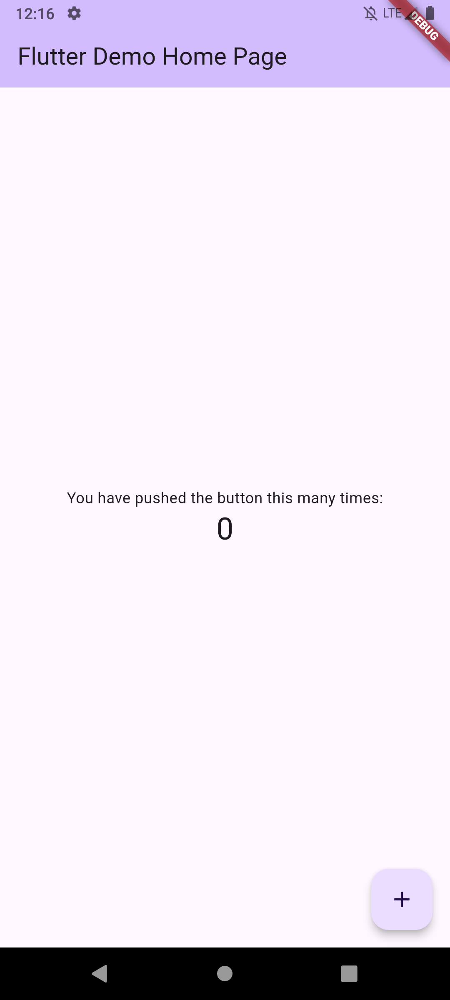

# Simply Do

A basic to-do app for adding everyday task.  
USP - Simple User Interface with all the basic functionalities.

## Ideas and Concepts:-

1. **Add Task**:- Simple interface to add task.
2. **View Task**:- A clean and organised view of all the tasks.
3. **Checkbox**:- Ability to mark complete or incomplete.
4. **Delete**:- Ability to delete a task.
5. **Edit**:- Ability to eidt a task.
6. **Due Date**:- Add due date and view task based on that. Also have unplanned task(with no due dates).
7. **Priority**:- Ability to set priority of a task.
8. **Reminders/Notification**:- A reminder at the starting of day to remind user for number of task he/she has planned for today. Ability to set reminder for each task.
9. **Recurring Tasks**:- Task can be repeated daily, weekly, monthly or custom days.
10. **Light/Dark Theme**:- Option to switch between multiple themes.
11. **Widgets**:- Widget for home screen.
12. **Timeline**:- A specific tab for all the activities done so far.
13. **Analytics**:- A detailed analytics page.

---

## Planning:-

- **Sidebar** contains User Profile Info(if set) and links to different pages. Those pages will be Tasks(default page), Timeline, Analytics, Profile, Premium, Contact and Other Apps.
- **Task Page** appbar at the top with title in middle and premium option at right. In bottomAppBar, 4 options - My Day, Planned, All, Completed. Floating action button will allow to add new task.
- **My Day** will contain all the tasks due today sorted according to priorities.
- **Planned** will contain all the tasks that is planned for some date. They will be sorted by date with date dropdown tag and then for each date, sorted by priorities.
- **All** will contain all the incomplete tasks, planned or otherwise. First Unplanned with dropdown tag and then planned with date dropdown tag.
- **Completed** will contain all the completed task. Users can mark them incomplete, or clear them all with a clear tag on the top.
- **Timeline** page will contain a timeline of all the activities that are performed. New task added, task completed, marked incomplete etc.
- **Analytics** page will contain a detailed analysis of percentage and number of task completed everyday(graph), average, most productive day, most productive hours(divided in the slot of three hours).
- **Settings** page will contain options related to profiles and settings. These options are Profile Info - Username, email, Notifications options(start of the day time). Email notifications(if possible - for premium), Subscription and Billing,Themes(premium), Database management - Clear all data, Clear all tasks, Clear timeline, clear analytics. Support - Contact.

---


## Design

### Base Color Palette -

```dart
Color accentPrimary = const Color(0xff6735AC);
    Color accentSecondary = const Color(0xff7E46D9);
    Color accentTertiary = const Color(0xff9180F9);
    Color backgroundPrimary = const Color(0xff1D1C2C);
    Color backgroundSecondary = const Color(0xff34344C);
    Color backgroundTertiary = Color.fromARGB(255, 35, 37, 53);
    Color foregroundPrimary = Color.fromARGB(255, 236, 245, 255);
    Color foregroundSecondary = const Color(0xffD9D9D9);
    Color foregroundTertiary = Color.fromARGB(255,  );
```

## Development

### Create App Project:-

Choose a dedicated development software and open command prompt from the folder and runt this command-

```
flutter create simply_do
```

- This will create a folder with the name 'simply_do'.
- Open the folder in VS code or any editor of your choice.
- Find the lib folder, this is where we are going to store all development files.
- Inside lib folder, you will see main.dart, this is the starting point of your app.

### Run App on Emulator:-

_Note: This step will require Android emulator to be installed through android studio._

- In VS code, type in search bar - >flutter then select Flutter: Launch Emulator.
- After emulator is successfully launched, go to your main.dart file and execute it.
- Now you will see flutter demo project on your emulator, something like this-



### Creating intitial setup for our app:-

