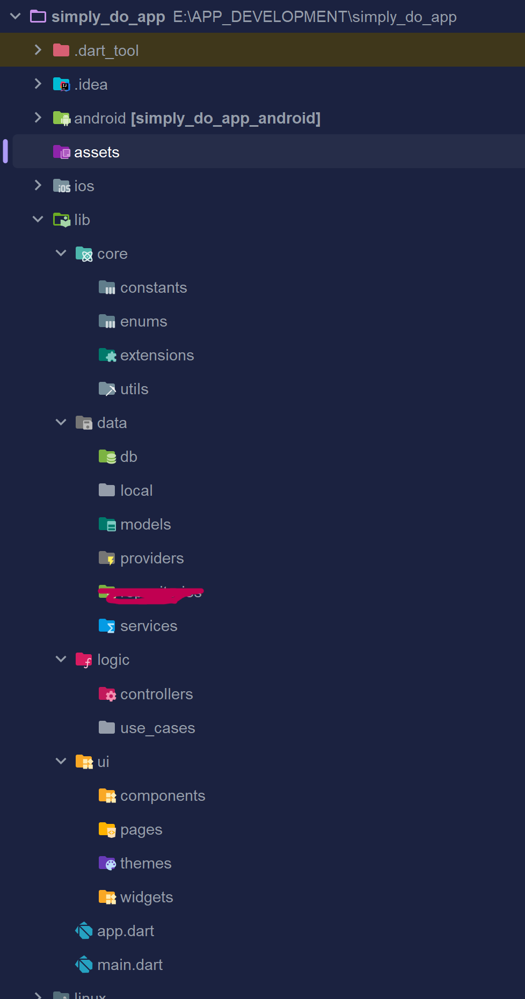

# Structure and Basics

## Create a New Flutter Project

First of all, let's create a new flutter project for our app.

Open terminal from your project folder and run the following command:

```dart
flutter create simply_do_app
```

This will create a new flutter project named "simply_do_app" in your folder.

Now, open this project in your favourite code editor(Visual Studio Code, Android Studio, etc.) and let's get started!

## Folder Structure

When you create a new project, by default you are going to see a few folders and files. But, don't get iverwhelmed by that. We are only going to need a very few of them.

The main files/folder that we require are-

- lib folder: This will contain all the codes related to our app
- pubspec.yaml: This is the file where we declare our dependencies and assets.

Before starting to code, we are going to create few folders and files to keep everything structured.

In root directory( simply_do_app), create a new folder named "assets".: This will store all the assets(images, fonts, sounds, etc.) that we are going to use in the app.

Inside lib folder, create the following folders and files-

- core(folder): Everything related to core items of the app. This will contain four other folders.
  - constants(folder): This will contain all the constant values that we are going to use in the app like colors, names, keys etc.
  - enums(folder): This will contain all the enums that we are going to use in the app.
  - utils(folder): This will contain all the utility functions that will provide extra help like conversions, formating etc.
  - extentions(folder): This will contain all the dart extentions to enhance bult in types like adding custom methods to Strings, DateTime etc.
- Data(folder): Everything related to data in the app.
  - models(folder): This will contain all the model classes that we are going to use in app.
  - providers: This will contain providers for state management of the app(Using Riverpod).
  - services(folder): This will contain all the services that will handle data from different sources like external APIs.
  - db(folder): This will contain all the database related files(using SQflite).
  - local(folder): This will contain files realted to shared preferences.
- logic(folder): This will contain all the business logic of the app. It will have two subfolders.
  - controllers(folder): This will contain all the controllers that will handle the business logic of the app.
  - use_case(folder): This will contain all the use cases of the app. Use cases are specific business logic that are common for group.
- ui(folder): This will contain all the UI related files. It will have four subfolders.
  - pages(folder): This will contain all the pages/screens of the app.
  - widgets(folder): This will contain all the widgets that are used in the app across multiple pages.
  - components(folder): This will contain all the components that are used in the app across multiple pages. Components are smaller than widgets and are used to build widgets.
  - themes(folder): This will contain all the themes that are used in the app.
- app.dart: This is the main file of our app. This is the file that consits MaterialApp and theme setup.
- main.dart: This is the main entry point of our app. This is the file that is run when we start our app.

The final folder structure will contain these files(and other default files/folders that are created by flutter)-



## Adding Required Packages

To make our app more efficient and feature rich, we are going to use some 3rd party package that are made for flutter. This is a common practice for flutter apps.

These are the packages that we are going to add:

- shared_preferences: This package is used to store data locally in the device.
- path: This package is used to get the path of the app's local directory.
- intl: This package helps with multiple formatting and conversions.
- flutter_svg: This package is used to render SVG files in flutter.
- go_router: This package is used for navigation in our app.
- flutter_riverpod: This package is used for state management in our app.
- sqflite: This package is used to work with SQLite database in flutter.

(Note: You can find all these packages on the official website, [pub.dev](https://pub.dev/))

To add these packages, open your terminal and write these commands

```
flutter pub add shared_preferences path intl flutter_svg go_router flutter_riverpod sqflite
```

If everything is successfull, you can open pubspec.yaml file and there you will see something like this -


## Setting Up main.dart

Everything is set, now it's time to start coding our app. We will first start with the main.dart file. This is the entry point of our app, a file that will be executed. \

Open main.dart file, remove all the default code and write the following lines.

```dart
import 'package:flutter/material.dart';
import 'package:flutter_riverpod/flutter_riverpod.dart';

void main() {
  runApp(
    ProviderScope(
      child: MyApp(),
    ),
  );
}
```

Note: If you are seeing an error line below MyApp, that's normal(because we haven't created MyApp widget yet).

Let's talk about what's happening in these line:

- First, we are importing two packages. 1. material.dart from flutter package and 2. flutter_riverpod.dart from flutter_riverpod package that we added earlier.
- Then, we are creating a main function that will be executed when we run our app.
- Inside main function, we are calling runApp() function: This function takes a-top level widget as parameter and runs that widget as our app. In our case, we are passing ProviderScope widget as parameter. This widget is from flutter_riverpod package. This widget is used to provide state management to our app. Adding it on the very top will provide all the features throughout the app.

## Setting Up app.dart

Now, let's move to app.dart file. This is the file where we will setup our MaterialApp and theme. We will later also define routers here which will enhance navigation in our app.

Open app.dart file and write the following lines.

```dart
import 'package:flutter/material.dart';

class MyApp extends StatelessWidget {
  const MyApp({super.key});

  @override
  Widget build(BuildContext context) {
    return MaterialApp(
      debugShowCheckedModeBanner: false,
      // Todo: Add theme
    );
  }
}
```

Note: Our app.dart is not complete yet, once we create some basic pages for our app and routes and define themes for it, we will add those to app.dart.

Now go back to main.dart and hover your mouse on the error line. It will ask you to import app.dart file. Click on it and it will import the file.

You can also do it manually by adding this line for code.

```dart
import 'app.dart';
```

Note: If you are seeing error in test folder, it's irrelavant but it's also asking for same import. You can do the same there to remove the error.

---

Now our part 1 is finished here. We have successfuly created our flutter app, defined the right folder structure, add required packages and setup our main.dart and app.dart files.

Let's continue this on the next part.
