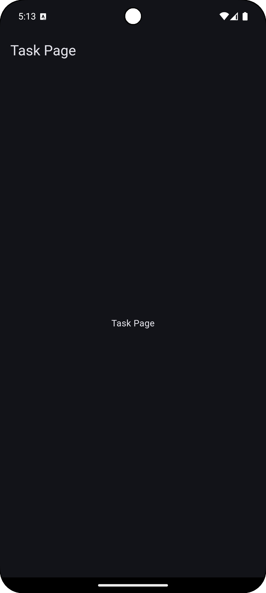

# Themes, Pages and Routes

## Defining 2 Base Theme for the App(And Save it using Shared Preferences)

Let's define one light theme and one dark theme for our app but in a way that later in the road, we have a way to add more themes to offer as a premium feature.

### Defining Colors

In core/constants folder, create a new file `colors.dart` and add the following code:

```dart
import 'package:flutter/material.dart';

ColorScheme lightColorScheme = ColorScheme.fromSeed(
  seedColor: const Color(0xFF0076FF),
  brightness: Brightness.light,
  primary: const Color(0xFF0076FF),
  secondary: const Color(0xFF226FD2),
  tertiary: const Color(0xFF63A7FF),
  primaryContainer: const Color(0xFFFFFFFF),
  secondaryContainer: const Color(0xFFD0D0D0),
  tertiaryContainer: const Color(0xFFA3A3A3),
  onPrimaryContainer: const Color.fromARGB(255, 0, 0, 0),
  onSecondaryContainer: const Color.fromARGB(255, 23, 23, 23),
  onTertiaryContainer: const Color.fromARGB(255, 40, 40, 40),
  primaryFixed: const Color(0xFFFF4D4F),
  secondaryFixed: const Color(0xFF52C41A),
  tertiaryFixed: const Color(0xFFFAE714),
  primaryFixedDim: const Color(0xFFFF9100),
);

ColorScheme darkColorScheme = ColorScheme.fromSeed(
  seedColor: const Color(0xFF0076FF),
  brightness: Brightness.dark,
  primary: const Color(0xFF0076FF),
  secondary: const Color(0xFF226FD2),
  tertiary: const Color(0xFF63A7FF),
  primaryContainer: const Color(0xFF0D1B2A),
  secondaryContainer: const Color(0xFF1B263B),
  tertiaryContainer: const Color(0xFF151E2F),
  onPrimaryContainer: const Color(0xFFFFFFFF),
  onSecondaryContainer: const Color(0xFFD0D0D0),
  onTertiaryContainer: const Color(0xFFA3A3A3),
  primaryFixed: const Color(0xFFFF4D4F),
  secondaryFixed: const Color(0xFF52C41A),
  tertiaryFixed: const Color(0xFFFAE714),
  primaryFixedDim: const Color(0xFFFF9100),
);

// Can define more ColorSchemes here...
```

There is nothing to explain here, we are simply defining color scemes for different themes.

Note: You can choose your own colors for your app. There are some really cool websites out there which can help you decide. Some of theme are:-

- https://coolors.co/
- https://colorhunt.co/
- https://dribbble.com/
- https://www.behance.net/

### Defining Themedata

Now we are going to use the colorschemes to define different theme data for our app. Remember, theme data is not just about colors, later we will come back to this and add various themes for various widgets or part of the app.

In ui/themes create three new dart file `theme_data.dart`, `dark_theme.dart` and `light_theme.dart`.

dark_theme will contain data related to dark themes:

```dart
import 'package:flutter/material.dart';
import '../../core/constants/colors.dart';

ThemeData darkTheme = ThemeData(
  colorScheme: darkColorScheme,
  // Other Theme properties
);
```

light_theme will contain data related to light themes:

```dart
import 'package:flutter/material.dart';
import 'package:simply_do_app/core/constants/colors.dart';

ThemeData lightTheme = ThemeData(
  colorScheme: lightColorScheme,
  // Other Theme properties
);
```

theme_data will contain export files for all the themes:

```dart
export 'dark_theme.dart';
export 'light_theme.dart';
```

Why use export?
Because of export, we can import all the themes just by importing theme_data.dart file.

### Creating Shared Preferences

Defining multiple theme is no good if we don't find a way to store it. That is where shared prefrences comes in. Shared Prerefences is a way to store data locally on the device. It is a key-value pair storage system.

In data/local create a new file named `theme_prefs.dart` and add the following code:

```dart
import 'package:shared_preferences/shared_preferences.dart';

class ThemePrefs {
  Future<void> saveTheme(String themeName) async {
    SharedPreferences prefs = await SharedPreferences.getInstance();
    await prefs.setString('theme', themeName);
  }

  Future<String?> getTheme() async {
    SharedPreferences prefs = await SharedPreferences.getInstance();
    return prefs.getString('theme');
  }
}
```

In this code, we are creating a class `ThemePrefs` which has two methods `saveTheme` and `getTheme`. `saveTheme` takes a string as parameter and saves it in shared preferences. `getTheme` returns a string which is saved in shared preferences.

Now you must be thinking that we need to save ThemeData type, but here we are saving String data type.
Here is the thing about shared preferences, it can only store primitive data types. So, we will have to find a way to assign some string to each one of our theme so that we can save it in shared preferences and then retrieve the string and convert it into ThemeData type.

Best way to do this is to create a map of string and ThemeData.

### Creating Themes Map

Mapping is a best way to save key-value pairs. Here we are going to take String keys and ThemeData as values. And instead of saving ThemeData, we will save the key(String) and later retrieve it and use the ThemeData assigned to it.

In core/constants create a new file `themes_map.dart` and the following code:

```dart
import 'package:flutter/material.dart';

import '../../ui/themes/theme_data.dart';

final Map<String, ThemeData> themesMap = {
  "light": lightTheme,
  "dark": darkTheme,
  // add more keys here
};
```

### Creating Theme Controller

We have created themes, we have assigned them as key-value pairs using map, and we have created shared preferences to save them. But there is one major role that is still left - State Management.

We want to create a way that once user selected themes is retrieved from the shared preferences, it is available to entire app, and we can use those colors wherever we want. And not just that, when user decides to change the theme, it changes for entire app.

Technically, you can call shared preferences directly inside the UI, but that is not the best practice. You would want to create some kind of state-management system that will save and retrieve data from the storage and make it available to the entire app. In our case, that's Riverpod.

In logic/controllers create a new file `theme_controller.dart` and add the following code:

```dart
import 'package:flutter/material.dart';
import 'package:flutter_riverpod/flutter_riverpod.dart';
import 'package:simply_do_app/ui/themes/theme_data.dart';

import '../../core/constants/themes_map.dart';
import '../../data/local/theme_prefs.dart';

class ThemeController extends Notifier<ThemeData> {
  ThemeController(this._themePrefs);

  final ThemePrefs _themePrefs;

  @override
  ThemeData build() {
    return darkTheme;
  }

  Future<void> loadThemes() async {
    final String? savedThemeName = await _themePrefs.getTheme();
    if (savedThemeName == null) {
      state = darkTheme;
    } else {
      state = themesMap[savedThemeName] ?? darkTheme;
    }
  }

  Future<void> updateTheme(ThemeData theme) async {
    state = theme;
    String themeName =
        themesMap.keys.firstWhere((key) => themesMap[key] == theme);
    await _themePrefs.saveTheme(themeName);
  }
}
```

Now let's talk about what we are actually doing here:

- We are creating a class `ThemeController` which extends `Notifier<ThemeData>`. This means that this class will notify the app whenever there is a change in the state. Notifier is a part of Riverpod package and ThemeDate is data type that we are storing and changing.
- We are creating a constructor that takes `ThemePrefs` as parameter. This is because we need to save and retrieve data from shared preferences(we created this class earlier in shared preferences section).
- We are overriding `build()` method. This method is used to return the initial state of the app. Here we are returning darkTheme. We could technically ask build method to retrieve theme from shared preferences, but that would be a bad practice. You should not use async method inside build method.
- We are creating two methods `loadThemes` and `updateTheme`. `loadThemes` is used to retrieve the theme from shared preferences and update the state. `updateTheme` is used to update the state and save the theme in shared preferences. You can see how we using `themesMap` to save and retrieve the theme as String.

But this is only half of the game. We need a provider that can provide this controller state to UI.

### Creating Theme Provider

In data/providers create a new file `provider.dart` and add the following code:

```dart
import 'package:flutter/material.dart';
import 'package:flutter_riverpod/flutter_riverpod.dart';

import '../../logic/controllers/theme_controller.dart';
import '../local/theme_prefs.dart';

final themeControllerProvider =
    NotifierProvider<ThemeController, ThemeData>(() {
  return ThemeController(ThemePrefs());
});
```

Now themeControllerProvider is a provider that can provide the state of the app to the UI. This is all we need in our UI to set the theme.

You can use this provider in any widget like this:

```dart
ThemeData themeData = ref.watch(themeControllerProvider);
```

And to update the value of the theme, you can use this:

```dart
ref.read(themeControllerProvider.notifier).updateTheme(themeData);
```

So, let's make some changes in our `app.dart` file.

### Adding Theme to App

In `app.dart` file, add the following code:

```dart
import 'package:flutter/material.dart';
import 'package:flutter_riverpod/flutter_riverpod.dart';

import 'data/providers/provider.dart';

class MyApp extends ConsumerWidget {
  const MyApp({super.key});

  @override
  Widget build(BuildContext context, WidgetRef ref) {
    ThemeData themeData = ref.watch(themeControllerProvider);
    return MaterialApp(
      debugShowCheckedModeBanner: false,
      theme: themeData,
    );
  }
}
```

Let's talk about what changes we made here:

- We are importing `flutter_riverpod` package and `themeControllerProvider` from `data/providers/provider.dart` file.
- We are changing the class from `StatelessWidget` to `ConsumerWidget`. This is because we want to use `ref` inside our widget. `ref` is used to read the state of the app.
- We are creating a variable `themeData` which is of type `ThemeData` and is assigned the value of `ref.watch(themeControllerProvider)`. This means that this widget will watch for any changes in the state of the app and update the value of `themeData` accordingly.
- We are passing `themeData` to `theme` property of `MaterialApp` widget. This will set the theme of the app.

Later in the app, we will see how users can change the theme, but if you are curious, like I stated before, we will use code something like this:

```dart
ref.read(themeControllerProvider.notifier).updateTheme(themeData);
```

where thmeData is the theme that user wants to set.

Now we are done with the themes part.

## Creating Pages

We are going to create multiple pages in our app and each page will have it's own folder so that we can keep things organized.

Inside `ui/pages` folder, let's create few basic page folders.

- task_page: This page will provide the base for all the pages that will display tasks. The content will change but the base structure will remain the same.
- task_details_page: This page will display the details of the task.
- add_task_page: This page will be used to add new tasks.
- edit_task_page: This page will be used to edit existing tasks.
- prefs_page: This page will be used to display app preferences and settings.
- premium_page: This page will be used to display premium features and price options.

Later we might create some other sub pages but these are the base of our app.

After creating these folders, create a basic dart file for each page with base content and just a simple Text. Something like this.

`task_page.dart`:

```dart
import 'package:flutter/material.dart';
import 'package:flutter_riverpod/flutter_riverpod.dart';

class TaskPage extends ConsumerWidget {
  const TaskPage({super.key});

  @override
  Widget build(BuildContext context, WidgetRef ref) {
    return Scaffold(
      appBar: AppBar(
        title: const Text('Task Page'),
      ),
      body: const Center(
        child: Text('Task Page'),
      ),
    );
  }
}
```

We are not doing anything complicated here, we are simply creating a `Scaffold` with `AppBar` and `Center` widget with `Text` widget inside it. This will just create a heading and a text in the center of the page.

Let's do this for all the pages.

`task_details_page.dart`:

```dart
import 'package:flutter/material.dart';
import 'package:flutter_riverpod/flutter_riverpod.dart';

class TaskDetailsPage extends ConsumerWidget {
  const TaskDetailsPage({super.key});

  @override
  Widget build(BuildContext context, WidgetRef ref) {
    return Scaffold(
      appBar: AppBar(
        title: const Text('Task Details'),
      ),
      body: const Center(
        child: Text('Task Details Page'),
      ),
    );
  }
}
```

`add_task_page.dart`:

```dart
import 'package:flutter/material.dart';
import 'package:flutter_riverpod/flutter_riverpod.dart';

class AddTaskPage extends ConsumerWidget {
  const AddTaskPage({super.key});

  @override
  Widget build(BuildContext context, WidgetRef ref) {
    return Scaffold(
      appBar: AppBar(
        title: const Text('Add Task'),
      ),
      body: const Center(
        child: Text('Add Task'),
      ),
    );
  }
}
```

`edit_task_page.dart`:

```dart
import 'package:flutter/material.dart';
import 'package:flutter_riverpod/flutter_riverpod.dart';

class EditTaskPage extends ConsumerWidget {
  const EditTaskPage({super.key});

  @override
  Widget build(BuildContext context, WidgetRef ref) {
    return Scaffold(
      appBar: AppBar(
        title: const Text('Edit Task'),
      ),
      body: const Center(
        child: Text('Edit Task Page'),
      ),
    );
  }
}
```

`prefs_page.dart`:

```dart
import 'package:flutter/material.dart';
import 'package:flutter_riverpod/flutter_riverpod.dart';

class PrefsPage extends ConsumerWidget {
  const PrefsPage({super.key});

  @override
  Widget build(BuildContext context, WidgetRef ref) {
    return Scaffold(
      appBar: AppBar(
        title: const Text('Preferences'),
      ),
      body: const Center(
        child: Text('Preferences Page'),
      ),
    );
  }
}
```

`premium_page.dart`:

```dart
import 'package:flutter/material.dart';
import 'package:flutter_riverpod/flutter_riverpod.dart';

class PremiumPage extends ConsumerWidget {
  const PremiumPage({super.key});

  @override
  Widget build(BuildContext context, WidgetRef ref) {
    return Scaffold(
      appBar: AppBar(
        title: const Text('Premium'),
      ),
      body: const Center(
        child: Text('Premium Page'),
      ),
    );
  }
}
```

Now we have all the basic pages that we need for now. Let's find a way to show them.

## Creating Router

We have created six pages in last section, but as I have said earlier, when we run the app, we only run the main function inside `main.dart` file. main function is executing MyApp class in `app.dart` file. But these pages are not connected to any of it.

That's where the router comes in. Router is a way to navigate between different pages in the app.

Before creating the router, we need to define varibles for all the paths.

In `core/constants` create a new file `app_routes.dart` and add the following code:

```dart
class AppRoutes {
  static const String taskPage = '/';
  static const String addTaskPage = '/add-task';
  static const String editTaskPage = '/edit-task';
  static const String taskDetailsPage = '/task-details';
  static const String prefsPage = '/preferences';
  static const String premiumPage = '/premium';
}
```

This is a simple class with static variable that define the 6 paths that we need for 6 pages.

Now let's create the router. In `core/utils` create a new file `router.dart` and add the following code:

```dart
import 'package:go_router/go_router.dart';
import 'package:simply_do_app/core/constants/app_routes.dart';
import 'package:simply_do_app/ui/pages/add_task_page/add_task_page.dart';
import 'package:simply_do_app/ui/pages/edit_task_page/edit_task_page.dart';
import 'package:simply_do_app/ui/pages/prefs_page/prefs_page.dart';
import 'package:simply_do_app/ui/pages/premium_page/premium_page.dart';
import 'package:simply_do_app/ui/pages/task_details_page/task_details_page.dart';
import '../../ui/pages/task_page/task_page.dart';

final GoRouter router = GoRouter(
  routes: [
    GoRoute(
      path: AppRoutes.taskPage,
      builder: (context, state) => const TaskPage(),
    ),
    GoRoute(
      path: AppRoutes.addTaskPage,
      builder: (context, state) => const AddTaskPage(),
    ),
    GoRoute(
      path: AppRoutes.editTaskPage,
      builder: (context, state) => const EditTaskPage(),
    ),
    GoRoute(
      path: AppRoutes.taskDetailsPage,
      builder: (context, state) => const TaskDetailsPage(),
    ),
    GoRoute(
      path: AppRoutes.prefsPage,
      builder: (context, state) => const PrefsPage(),
    ),
    GoRoute(
      path: AppRoutes.premiumPage,
      builder: (context, state) => const PremiumPage(),
    ),
  ],
);
```

This is the syntax of `go_router` package. We are creating a variable `router` which is of type `GoRouter`. I takes 1 required parameter `routes` which is a list of `GoRoute`. Each `GoRoute` takes 2 parameters `path` and `builder`. `path` is the path of the page and `builder` is the widget that will be displayed when that path is called.

Here are three basic syntax for nagation:

- 1. `context.go(AppRoutes.taskPage);`: This replaces the current page with the target page assigned to path.
- 2. `context.push(AppRoutes.taskPage);`: This pushes the target page on top of the current page. This allows the user to return to the previous page with the back button.
- 3. `context.pop();`: This removes the current page from the stack and takes the user to the previous page(if there are no paged left in the stack, it closes the app).

Later in the app we will also see how to add parameters in the routes. But for now, all is set, all we need to do is add our router to the app.

### Adding Router to App

In `app.dart` file, add the following code:

```dart
import 'package:flutter/material.dart';
import 'package:flutter_riverpod/flutter_riverpod.dart';

import 'core/utils/router.dart';
import 'data/providers/provider.dart';

class MyApp extends ConsumerWidget {
  const MyApp({super.key});

  @override
  Widget build(BuildContext context, WidgetRef ref) {
    ThemeData themeData = ref.watch(themeControllerProvider);
    return MaterialApp.router(
      debugShowCheckedModeBanner: false,
      theme: themeData,
      routerConfig: router,
    );
  }
}
```

Let's talk about what changes we made here:

- We are importing `router` from `core/utils/router.dart` file.
- We are returning `MaterialApp.router` instead of `MaterialApp`.
- We are adding 'routConfig' parameter and assigning it the value of `router` variable that we created earlier.

Now that our router is in place. We can run our app for the first time. If you don't know how to do that, I recommend you to read [this](https://flutter.dev/docs/get-started/test-drive?tab=vscode) article or watch any tutorial on youtube.

If everything goes well, you should see a blank screen with a heading `Task Page` in the center. This is the default page. Later we will add a drawer in our app to navigate to other pages.



---

In this section, we started with defining all the colors for the app in color scheme and then used those schemes to create multiple theme data. We also created a way to save and retrieve the theme from shared preferences and manage it's state using controller and provider. Then we created multiple pages for the app and some basic structure inside them. And finally we created a router to navigate between these pages and added the router to our app.
